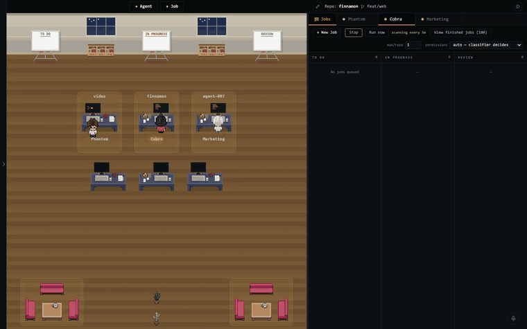

# Agent 007

[](https://github.com/bill10/agent-007/actions/workflows/test-ubuntu.yml)
[](https://github.com/bill10/agent-007/actions/workflows/test-windows.yml)

**From web terminals for your coding agents to a self-running agent company.**



*Recorded from the running app. If the capture does not load, there is a [still screenshot](docs/screenshot.png).*

Use it as far along as you need:

1. **One task: one agent in a web terminal.** Start Claude Code, Codex or any CLI agent in the browser. Add a repo once; every agent gets its own git worktree and branch, so you never set one up by hand.
2. **Many tasks across projects: many terminals, one window.** Every repo and every agent in one place, with live terminals, a file explorer, inline diffs, and a pixel office where each agent faces its screen while it works and turns to you when it needs you.
3. **Stop watching them: a job board.** Put tasks on the board and Claude Code or Codex workers pick them up, each in its own worktree, and move them To do -> In progress -> Review on their own, landing as a pull request (or a summary, for work that isn't code). Cards can run on a cron schedule, and agents can post cards and message each other.
4. **Stop posting jobs: give Billion a goal.** Billion is one always-on agent that plans, posts the jobs, reviews what comes back and merges the PRs. It only asks you about money, access or anything irreversible.

Claude Code, Codex, any terminal agent is supported -- use your existing subscriptions, no extra charge.

It runs locally on your machine, so agents work while it is on and awake. Billion's plan and memory live in a git repo, so it picks up where it left off after a restart. Every worker is a real terminal you can open and type into, from your phone too ([remote access](docs/REMOTE.md)).

## Quick Start

```bash
npx @bill10/agent-007
```

Or install it globally with `npm i -g @bill10/agent-007`, then run `agent-007`.

Or run it from a clone:

```bash
git clone https://github.com/bill10/agent-007.git && cd agent-007
npm install
npm start
```

Open [http://localhost:7007](http://localhost:7007). Click **+ Job** to queue work on the board, or **+ Agent** to start one by hand -- preset buttons (Claude Code, Codex, Gemini, Bash; PowerShell on a Windows server) fill in the command, or type your own under Advanced. Needs Node.js 20.12+ and Git ([full requirements](#requirements)).

### Settings

It works with no configuration. To change something, create a settings file:

```bash
npx @bill10/agent-007 init    # writes ~/.agent-007/.env, every line commented out
```

Uncomment what you want, then restart. The ones people change:

| Setting | What it does |
|---------|--------------|
| `BILLION=0` | Turns off Billion, the always-on agent |
| `TELEGRAM_BOT_TOKEN` + `TELEGRAM_CHAT_ID` | Billion's questions reach your phone, and you answer from there ([setup](docs/BILLION.md#telegram)) |
| `HOST=0.0.0.0` + `ALLOWED_ORIGINS=<tailnet name>` | Reach it from your phone or another machine (behind Tailscale only, see [docs/REMOTE.md](docs/REMOTE.md)) |
| `CLAUDE_PERMISSION_MODE` | Mode Claude Code agents start in, e.g. `bypassPermissions` |
| `CODEX_PERMISSION_MODE` | The same for Codex |
| `TRUST_BOARD_WORKTREES=0` | Keeps Claude Code's and Codex's folder-trust prompt for job board workers |
| `PORT` | Port to listen on (default `7007`) |

Highest wins: command-line flags (`--port`), then environment variables, then
a `.env` in the directory you start it from, then `~/.agent-007/.env`. The full
list is in [Configuration](#configuration) and `--help`.

The details and caveats of every feature -- phone layout, voice input, themes and more -- are in [docs/FEATURES.md](docs/FEATURES.md).

## Keyboard Shortcuts

| Key | Action |
|-----|--------|
| `Cmd+N` | Spawn a new agent |
| `Cmd+1..9` | Switch to agent by tab position |
| `Cmd+E` | Toggle the file explorer panel |
| `Cmd+D` | Toggle voice input (dictation) |

## How It Works

Each agent runs in its own [git worktree](https://git-scm.com/docs/git-worktree), so multiple agents can work on the same repo without stepping on each other. The server manages PTY processes via [node-pty](https://github.com/microsoft/node-pty) and communicates with the browser over WebSocket. The pixel office is rendered on an HTML canvas with a day/night cycle that follows your local time.

Every agent's branch starts from your repository's base branch as it exists on
the remote, fetched just before the worktree is created, so an agent never picks
up a stale local base or whatever unrelated branch you happen to have checked
out. Override it per agent with **Advanced -> Start from** when you want to
branch off work in progress.

The job board reuses that same machinery: a dispatched job is an ordinary agent, with a real terminal you can type into and take over at any point. Each job gets its own worktree and branch, so a job maps one-to-one onto a branch and a pull request. When the agent finishes it calls the board's `finish_job` tool (a card that requires a pull request hands over the PR it opened; one that does not hands over a summary), and the card moves to Review with the agent still running, so you can click straight into it to ask about the work. When the card reaches Done the board closes the agent and releases its worktree and local branch; the PR itself is untouched, and work that was never pushed is kept as an orphan rather than deleted. **Re-spawn** on an orphan picks that conversation back up with the CLI it ran, `codex resume <session-id>` (the newest Codex session recorded in that exact worktree) or `claude --continue`, under the permission mode its job card was dispatched with (a board agent whose card is already finished or deleted follows the board's current setting), or, for an agent you spawned by hand, under the permission flags you started it with. A board worker re-spawned after a restart is its card's worker again: it counts toward the cap, sends its approvals where the card says, is told once to carry on if its card is still In progress, and leaves like any other board worker when the card is filed. When the PR merges the job is filed away as finished -- the record is kept, the card is not.

```
┌─────────────┬──────────────┬────────────────────┐
│  Explorer   │  Pixel       │  Jobs + Terminals   │
│  (repos,    │  Office      │  (job board tab,    │
│   files,    │  (canvas,    │   xterm.js, one     │
│   diffs)    │   agents)    │   tab per agent)    │
└─────────────┴──────────────┴────────────────────┘
```

## Configuration

Settings are environment variables. Set them inline, in `~/.agent-007/.env`
(`npx @bill10/agent-007 init` creates it from [`.env.example`](.env.example),
every setting explained and commented out), or in a `.env` in the directory you
start from. `npx @bill10/agent-007`, a global `agent-007` and `npm start` in a
clone all read both files, and the startup log names the ones it loaded. Highest
wins: flags (`--port 8080` overrides `PORT`), then the environment, then
`./.env`, then `~/.agent-007/.env`. `--help` lists them all. Everything the app
saves lives in `~/.agent-007` (`AGENT007_CONFIG_DIR` moves it, and the settings
file with it).

```bash
PORT=8080 npm start                       # Custom port (default: 7007)
HOST=0.0.0.0 npm start                    # Bind all interfaces (default: 127.0.0.1)
ALLOWED_ORIGINS=mac-mini.tailXXXX.ts.net npm start   # Allow a remote browser origin
```

| Variable | Default | Purpose |
|----------|---------|---------|
| `PORT` | `7007` | Listen port |
| `HOST` | `127.0.0.1` | Bind interface. Use `0.0.0.0` only behind Tailscale/a trusted network |
| `ALLOWED_ORIGINS` | *(none)* | Comma-separated extra origins for the cross-origin check (`localhost` is always allowed) |
| `CLAUDE_PERMISSION_MODE` | *(the CLI's own)* | Permission mode every Claude Code agent the app starts runs in (`auto`, `acceptEdits`, `bypassPermissions`, `manual`, `dontAsk`, `plan`). Flags in the command, a card's own mode or a mode picked in the board's dropdown win over it |
| `CODEX_PERMISSION_MODE` | *(the CLI's own)* | The same for Codex agents, mapped onto Codex's sandbox and approval flags |
| `AGENT_MESSAGING` | *(guarded)* | `open` lets any of your agents message any other. By default an agent that asks before acting cannot message one that never asks |
| `BILLION` | *(on)* | `0` (or `false`/`off`/`no`) turns Billion off. It is also off whenever user accounts exist, since it would belong to everyone |
| `BILLION_DIR` | `~/.agent-007/billion` | Billion's own folder and git repo. Point it at a new or empty folder |
| `TELEGRAM_BOT_TOKEN` | *(off)* | A Telegram bot's token. Billion's `notify_owner` questions are sent through it, and replies come back into Billion's terminal. See [docs/BILLION.md](docs/BILLION.md#telegram) |
| `TELEGRAM_CHAT_ID` | *(none)* | Your chat with the bot. The only chat whose messages reach Billion; unset, the server logs the id of the first chat that messages the bot |
| `TELEGRAM_VOICE` | `mirror` | Voice on Telegram: `mirror` answers in the mode of your last message, `always` speaks, `never` is text. Speaking needs macOS `say` and ffmpeg. See [Voice](docs/BILLION.md#voice) |
| `WHISPER_MODEL` | *(none)* | Full path to a whisper.cpp ggml model (e.g. `ggml-base.en.bin`); with `whisper-cli` installed, your voice notes are transcribed locally for Billion |
| `WHISPER_CPP_BIN` | *(on PATH)* | whisper.cpp's CLI, when `whisper-cli`/`whisper-cpp`/`main` is not on `PATH` |
| `TRUST_BOARD_WORKTREES` | *(on)* | Board-dispatched Claude Code and Codex workers skip the workspace-trust dialog, so queued jobs start unattended. That also lets the repo's own `.claude/settings.json` (or Codex project config, hooks and exec policies) apply without asking. `0` (or `false`/`off`/`no`) keeps the dialog. Hand-started agents always keep it |

> **Running remotely?** The server spawns real shells, so never expose it to the
> open internet. See [docs/REMOTE.md](docs/REMOTE.md) for the recommended
> Tailscale setup.

### Multiplayer & login

By default there are no user accounts and no login — the app runs open on
localhost, exactly as before. To turn on per-user login (for shared/remote use),
create a user:

```bash
npm run adduser -- "Alice"     # prints a one-time login token
npx @bill10/agent-007 adduser "Alice"  # the same, without a clone
```

The moment the first user exists, the server **requires a token** for every
`/api` call and WebSocket connection. Log in by opening the app and pasting the
token, or visit `http://<host>:7007/?token=<token>` once (the token is stored in
your browser and stripped from the URL). Add a user per person; each gets a
distinct color and shows up in the presence indicator.

> Login establishes **identity**, not isolation — every logged-in user can still
> spawn their own shells on the host. Only issue tokens to people you'd give an
> SSH login, and keep the server behind Tailscale/a trusted network.
>
> Each agent is owned by the user who spawned it. You have full control of your
> own agents and are **read-only** on everyone else's — you see their live
> terminal but can't type into, resize, kill, rename, or upload to it (enforced
> server-side). The dimmed-tile / read-only-terminal UI polish is still to come
> (see [docs/designs/multiplayer.md](docs/designs/multiplayer.md)).
>
> Caveat: agents you spawned **before** creating the first user are unowned, so
> once auth is on anyone can still control them. Spawn agents after enabling auth
> (or restart them) if you want them owned.

## Requirements

- Node.js 20.12+
- Git
- A modern browser (three panels at 900px+, explorer hidden below that, one panel at a time on a phone)
- A CLI to run as the agent (defaults to `claude`, but works with any command)

Agent 007 runs on macOS, Linux, and Windows -- spawning agents, adding repos, and browsing paths all handle Windows natively, and CI runs the test suite on both Ubuntu and Windows. One Windows caveat: the per-agent MCP config file protects its token with POSIX file permissions, which Windows doesn't have, so on a shared Windows machine other local users can read it.

## Troubleshooting

**`npm install` fails building `node-pty`.** `node-pty` ships prebuilt binaries for macOS, Linux and Windows on x64 and arm64, so normally nothing compiles. Only if the install tries to build it from source and fails, install a C++ toolchain and run `npm install` again:

- **macOS:** Xcode Command Line Tools (`xcode-select --install`)
- **Linux:** `build-essential` and `python3` (`sudo apt install build-essential python3`)
- **Windows:** [Visual Studio Build Tools](https://github.com/microsoft/node-pty#windows) with the C++ workload

**An agent will not start: `"claude" is not installed, or not on the PATH Agent 007 was started with.`** The CLI the agent runs (`claude`, `codex` or `gemini`) was not found, and the message says how to install it. If it is installed, Agent 007 was started from somewhere with a shorter `PATH` than your shell (a launcher or a service manager, say); start it from a terminal where `which claude` finds it. Billion runs on Claude Code too, so without it Billion's tab says what to do instead: install Claude Code and press **Start** next to Billion, or restart with `BILLION=0` to turn Billion off.

## Architecture

```
server.js          Entry point + orchestrators (createSession, killSession)
server/
  state.js         Shared mutable state (sessions, orphans, pools, config)
  settings.js      Config dir and the settings files (./.env, ~/.agent-007/.env)
  config.js        Config persistence (load, save, crash recovery)
  direct-run.js    Entry-point detection (symlink/space-safe `npm start` guard)
  git.js           Git operations (worktree, file tree, diff)
  jobs.js          Job board dispatcher (scan, spawn, PR watch, schedule firing, attachment files)
  command-path.js  Checks a CLI is installed before a spawn; resolves commands to spawnable files on Windows (PATHEXT)
  pty.js           PTY lifecycle (spawn, handlers, state detection)
  ws.js            WebSocket (message routing, broadcast, origin check, shared terminal sizing)
  http.js          HTTP routes (/api/browse, /api/jobs, job attachment downloads, /mcp, origin + auth gates)
  mcp.js           The board's MCP server (post_job, list_jobs, read_job, edit_job, finish_job, list_agents, send_message; Billion also gets billion_ready, add_repo, close_job, answer_permission, notify_owner, read_agent_screen)
  messages.js      Agent-to-agent messages and board notices (who can reach whom, rate limit, queued until the recipient rests at its prompt)
  billion.js       Billion's folder (git repo, templates, charter refresh) and whether it runs
  approvals.js     Hands a worker's permission request to Billion and waits for its answer
  permission-hook.js  Claude Code PermissionRequest hook a worker on Billion's cards runs
  agent-mcp.js     Per-session MCP config + the flags that connect Claude Code and Codex to it
  agent-mcp-bridge.js  Codex stdio bridge to the board's HTTP endpoint
  agent-transcripts.js  Which CLI last ran in a worktree, read off its transcripts (re-spawn fallback)
  auth.js          Login tokens, user accounts, agent session tokens
bin/
  agent-007.js     The `agent-007` command (`npx @bill10/agent-007`): flags, .env, start
  adduser.js       Create a login user (`npm run adduser`)
public/
  index.html       Three-panel layout, plus the phone's bottom nav
  style.css        Dark/light themes via CSS custom properties
  app.js           Main entry point
  assets/          Pixel art sprites (characters/ MIT with vendored LICENSE; furniture/ mixes Antea CC-BY 4.0 and pixel-agents MIT, see Acknowledgements)
  modules/
    office.js      Canvas pixel art (workstations, characters, job boards, day/night)
    terminal.js    xterm.js terminals, clipboard paste, tab management
    explorer.js    File tree, diff viewer, repo management
    jobs.js        Job board UI (columns, cards, the job form)
    ws.js          WebSocket client with auto-reload on reconnect
    state.js       Shared client state (agents, repos, viewer identity, server platform, the panel a phone shows)
    shortcuts.js   Keyboard shortcuts
    voice.js       Voice input (Web Speech API dictation)
    auth.js        Login tokens, presence, HTML escaping
lib/
  helpers.js       State detection (dialog patterns per CLI, the synchronized-output frames Codex paints in), git parsing, codename/cocktail pools, the file-name sanitiser
  jobs.js          Pure job-board logic (states, prompts, dispatch selection)
  cron.js          Five-field cron parser (schedules for scheduled jobs)
templates/
  billion/         Billion's starting files (charter, owner rules, STATE.md, COMPANY.md)
```

## Acknowledgements

- Inspired by [pixel-agents](https://github.com/pablodelucca/pixel-agents), the VS Code extension that put AI agents in a pixel office first.
- Character sprites and the ambient decor sprites (`furniture/cactus.png`, `plant_2.png`, `sofa_side.png`, `sofa_front.png`, `coffee_table.png`, `coffee.png`, `table_front.png`, `chair_side.png`, `chair_back.png` -- the two chairs recolored, and `chair_front.png` drawn for this project in the same style) from [pixel-agents](https://github.com/pablodelucca/pixel-agents) (MIT, © Pablo De Lucca — license vendored at `public/assets/characters/LICENSE`), character bases by JIK-A-4's ["Metro City" free top-down character pack](https://jik-a-4.itch.io/metrocity-free-topdown-character-pack) (CC0)
- Desk and `bookshelf.png` sprites from the Free Furniture Office Equipment Set by Antea (CC-BY 4.0)

## Contributing

Contributions are welcome! See [CONTRIBUTING.md](CONTRIBUTING.md) for setup instructions and guidelines.

## License

[MIT](LICENSE)

If this is useful, a ⭐ helps others find it.
