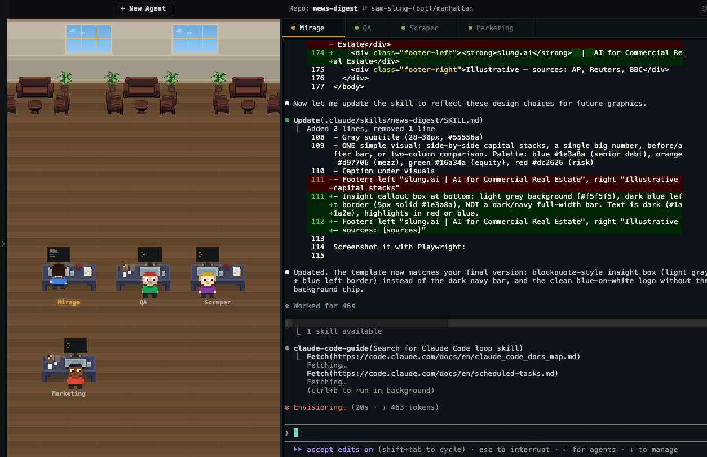

# Agent 007

[](https://github.com/bill10/agent-007/actions/workflows/test.yml)

A pixel office for managing AI terminal agents. Spawn Claude Code (or any CLI) instances into isolated git worktrees and watch them work side-by-side in a retro pixel art office.



## Why?

This project is inspired by [pixel-agents](https://github.com/pablodelucca/pixel-agents) (big shoutout to them), which is mainly a VS Code extension. However, I needed more than a VS Code extension, so I just vibe-coded one for my own use. If any of the following sounds like you, please feel free to give it a try or, even better, contribute and make it more useful.

- I normally have multiple Claude Code instances running simultaneously, and I rarely open VS Code to write code myself.
- I have multiple projects/repos being developed simultaneously, and a typical IDE's one-window-per-project view is not helpful.
- I need automatic worktree isolation when multiple agents are working on one repo for different features.
- I want something slightly more playful, since I'm talking to multiple terminals all day long.

## Features

- **Pixel office** -- Canvas-rendered workstations that show each agent's state at a glance (working, waiting, needs attention, idle, disconnected). Characters face the screen when working and turn around when waiting.
- **Git worktree isolation** -- Each agent gets its own worktree and branch automatically. No merge conflicts between agents working on the same repo. Branches are named with cocktail names (`bill/vesper`, `bill/martini`, ...).
- **Multi-repo support** -- Add any number of repos. Spawn agents on different repos and manage them all from one place.
- **Live file explorer** -- Real-time file tree with git status indicators, inline diff viewer, and a changes/all toggle to filter what you see.
- **Terminal multiplexer** -- Full xterm.js terminals with clickable URLs, clipboard image paste (Cmd+V a screenshot), and draggable tabs for reordering.
- **Job board** -- Queue work instead of babysitting it. A job has a title, details, and a repo; the board scans every 5 minutes, and for each queued job whose repo is under its agent cap it spawns a fresh agent on its own worktree and a branch named after the job, then watches for the pull request. Jobs move To do -> In progress -> Review on their own, and once the pull request merges the card leaves the board for **View finished jobs** -- so the Review column keeps meaning "needs your review". A finished card stays finished: it is the record of what shipped, and follow-up work is a new job. An agent that stops to ask you something turns its card orange and puts a count on the Jobs tab; click it to land in that terminal, answer, and it carries on.
- **Scheduled jobs** -- A card can also be a standing one, fired by a cron schedule (`0 9 * * 1-5`, or `@daily`) in the server's local time rather than dispatched once. A scheduled job need not be a coding task -- it does the work, writes what it found in its terminal, and when it goes quiet the board puts the card back in To do with its next run time, keeping the terminal open to read until the next run replaces it. It cycles To do -> In progress -> To do, never reaches Review, and sits outside the per-repo agent cap, so busy one-time jobs can't starve a schedule.
- **Ask an agent to post a job** -- Say "add that to the job board" to an agent you are already working with and it posts the card itself, so noticing work does not mean stopping to type it into the form. The board appears in every Claude Code agent as an MCP tool, so the agent can see it without being told it exists; Claude Code still asks you to approve the call, so a card is never filed behind your back. The card lands in To do showing "via <agent>", and runs in that terminal's repo unless the agent names another.
- **Dark/light themes** -- Gold-accented dark theme and a warm low-glare paper light theme tuned for long sessions (see [DESIGN.md](DESIGN.md)). Toggles instantly, terminal colors and office canvas included.
- **Live sync** -- Branch names, file changes, line-level diff stats (+/-), and agent states update in real time across all panels.
- **Voice input** -- Dictate prompts instead of typing. Click the mic button floating at the terminal's bottom-right (or `Cmd+D`), allow microphone access on first use, speak, and the transcript is typed into the active terminal; press Enter to send. Uses the browser's Web Speech API (Chrome, Edge, Safari; the recognition language follows your browser's locale) and needs HTTPS or localhost -- for remote access use `tailscale serve` (see `docs/REMOTE.md`). The mic is deliberately bounded: it stops after ~1 minute without delivered speech, always after 5 minutes, on switching or closing agents, when an agent's shell ends, and when the tab is hidden. Two things to know: most browsers process speech on vendor servers (Chrome/Edge send audio to Google/Microsoft; Safari may process on-device), so don't dictate secrets; and transcripts arrive as keystrokes, so a program waiting on a single key (a pager, a y/n prompt) reacts to speech like typing -- watch the prompt while dictating. OS-level dictation (macOS dictation, iOS keyboard mic, Windows `Win+H`) also types straight into the terminal and works in any browser.

## Quick Start

```bash
git clone https://github.com/bill10/agent-007.git
cd agent-007
npm install
npm start
```

Open [http://localhost:7007](http://localhost:7007) in your browser. Click **+ Agent**, pick a repo, and hit Start -- preset buttons (Claude Code, Codex, Gemini, Bash; PowerShell on a Windows server) fill in the command, or type your own under Advanced. **+ Job** posts work to the job board instead.

## Keyboard Shortcuts

| Key | Action |
|-----|--------|
| `Cmd+N` | Spawn a new agent |
| `Cmd+1..9` | Switch to agent by tab position |
| `Cmd+E` | Toggle the file explorer panel |
| `Cmd+D` | Toggle voice input (dictation) |

## How It Works

Each agent runs in its own [git worktree](https://git-scm.com/docs/git-worktree), so multiple agents can work on the same repo without stepping on each other. The server manages PTY processes via [node-pty](https://github.com/microsoft/node-pty) and communicates with the browser over WebSocket. The pixel office is rendered on an HTML canvas with a day/night cycle that follows your local time.

Every agent's branch starts from your repository's base branch as it exists on
the remote, fetched just before the worktree is created, so an agent never picks
up a stale local base or whatever unrelated branch you happen to have checked
out. Override it per agent with **Advanced -> Start from** when you want to
branch off work in progress.

The job board reuses that same machinery: a dispatched job is an ordinary agent, with a real terminal you can type into and take over at any point. Each job gets its own worktree and branch, so a job maps one-to-one onto a branch and a pull request. When the PR appears the board closes the agent and releases its worktree and local branch; the PR itself is untouched, and work that was never pushed is kept as an orphan rather than deleted. When the PR merges the job is filed away as finished -- the record is kept, the card is not.

```
┌─────────────┬──────────────┬────────────────────┐
│  Explorer   │  Pixel       │  Jobs + Terminals   │
│  (repos,    │  Office      │  (job board tab,    │
│   files,    │  (canvas,    │   xterm.js, one     │
│   diffs)    │   agents)    │   tab per agent)    │
└─────────────┴──────────────┴────────────────────┘
```

## Configuration

Configure via environment variables, either inline or in a `.env` file. On
startup `npm start` auto-loads `.env` if present (via Node's built-in
`--env-file-if-exists`). Copy the template to get going:

```bash
cp .env.example .env    # then edit; .env is gitignored
npm start
```

Or set them inline:

```bash
PORT=8080 npm start                       # Custom port (default: 7007)
HOST=0.0.0.0 npm start                    # Bind all interfaces (default: 127.0.0.1)
ALLOWED_ORIGINS=mac-mini.tailXXXX.ts.net npm start   # Allow a remote browser origin
```

| Variable | Default | Purpose |
|----------|---------|---------|
| `PORT` | `7007` | Listen port |
| `HOST` | `127.0.0.1` | Bind interface. Use `0.0.0.0` only behind Tailscale/a trusted network |
| `ALLOWED_ORIGINS` | *(none)* | Comma-separated extra origins for the cross-origin check (`localhost` is always allowed) |

> **Running remotely?** The server spawns real shells, so never expose it to the
> open internet. See [docs/REMOTE.md](docs/REMOTE.md) for the recommended
> Tailscale setup.

### Multiplayer & login

By default there are no user accounts and no login — the app runs open on
localhost, exactly as before. To turn on per-user login (for shared/remote use),
create a user:

```bash
npm run adduser -- "Alice"     # prints a one-time login token
```

The moment the first user exists, the server **requires a token** for every
`/api` call and WebSocket connection. Log in by opening the app and pasting the
token, or visit `http://<host>:7007/?token=<token>` once (the token is stored in
your browser and stripped from the URL). Add a user per person; each gets a
distinct color and shows up in the presence indicator.

> Login establishes **identity**, not isolation — every logged-in user can still
> spawn their own shells on the host. Only issue tokens to people you'd give an
> SSH login, and keep the server behind Tailscale/a trusted network.
>
> Each agent is owned by the user who spawned it. You have full control of your
> own agents and are **read-only** on everyone else's — you see their live
> terminal but can't type into, resize, kill, or upload to it (enforced
> server-side). The dimmed-tile / read-only-terminal UI polish is still to come
> (see [docs/designs/multiplayer.md](docs/designs/multiplayer.md)).
>
> Caveat: agents you spawned **before** creating the first user are unowned, so
> once auth is on anyone can still control them. Spawn agents after enabling auth
> (or restart them) if you want them owned.

## Requirements

- Node.js 20.12+
- Git
- Desktop browser (900px+ viewport)
- A CLI to run as the agent (defaults to `claude`, but works with any command)
- **macOS:** Xcode Command Line Tools (`xcode-select --install`)
- **Linux:** `build-essential` and `python3` (`sudo apt install build-essential python3`)
- **Windows:** [Visual Studio Build Tools](https://github.com/microsoft/node-pty#windows) with the C++ workload

> **Note:** `node-pty` (used for terminal sessions) is a native addon that requires a C++ compiler. The requirements above ensure it compiles during `npm install`.

Agent 007 runs on macOS, Linux, and Windows -- spawning agents, adding repos, and browsing paths all handle Windows natively, and CI runs the test suite on both Ubuntu and Windows. One Windows caveat: the per-agent MCP config file protects its token with POSIX file permissions, which Windows doesn't have, so on a shared Windows machine other local users can read it.

## Architecture

```
server.js          Entry point + orchestrators (createSession, killSession)
server/
  state.js         Shared mutable state (sessions, orphans, pools, config)
  config.js        Config persistence (load, save, crash recovery)
  direct-run.js    Entry-point detection (symlink/space-safe `npm start` guard)
  git.js           Git operations (worktree, file tree, diff)
  jobs.js          Job board dispatcher (scan, spawn, PR watch, scheduled runs)
  command-path.js  Resolves commands to spawnable files on Windows (PATHEXT)
  pty.js           PTY lifecycle (spawn, handlers, state detection)
  ws.js            WebSocket (message routing, broadcast, origin check)
  http.js          HTTP routes (/api/browse, /api/jobs, /mcp, origin + auth gates)
  mcp.js           The board's MCP server (the post_job tool agents call)
  agent-mcp.js     Per-session MCP config + the flags that point `claude` at it
  auth.js          Login tokens, user accounts, agent session tokens
bin/
  adduser.js       Create a login user (`npm run adduser`)
public/
  index.html       Three-panel layout
  style.css        Dark/light themes via CSS custom properties
  app.js           Main entry point
  modules/
    office.js      Canvas pixel art (workstations, characters, job boards, day/night)
    terminal.js    xterm.js terminals, clipboard paste, tab management
    explorer.js    File tree, diff viewer, repo management
    jobs.js        Job board UI (columns, cards, the job form)
    ws.js          WebSocket client with auto-reload on reconnect
    state.js       Shared agent state
    shortcuts.js   Keyboard shortcuts
    voice.js       Voice input (Web Speech API dictation)
    auth.js        Login tokens, presence, HTML escaping
lib/
  helpers.js       State detection, git parsing, codename/cocktail pools
  jobs.js          Pure job-board logic (states, prompts, dispatch selection)
  cron.js          Five-field cron parser (schedules for scheduled jobs)
```

## Contributing

Contributions are welcome! See [CONTRIBUTING.md](CONTRIBUTING.md) for setup instructions and guidelines.

## License

[MIT](LICENSE)
