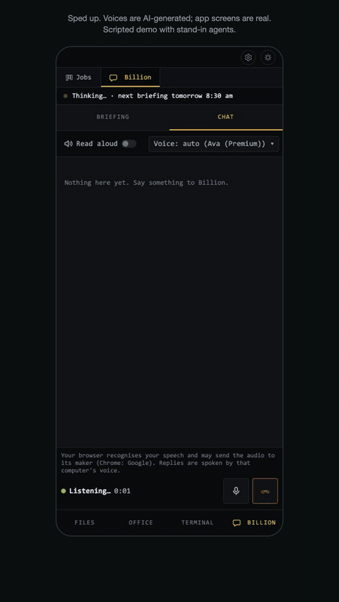
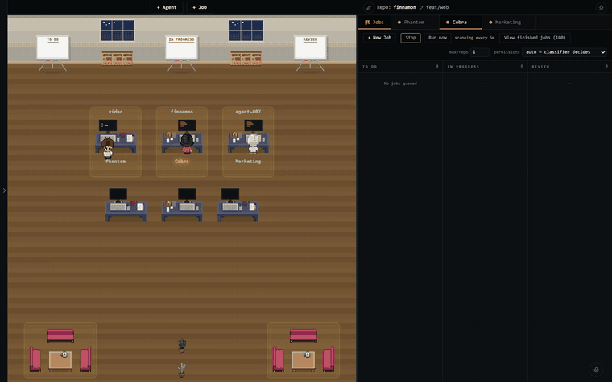

# Agent 007

[](https://github.com/bill10/agent-007/actions/workflows/test-ubuntu.yml)
[](https://github.com/bill10/agent-007/actions/workflows/test-windows.yml)

**Manage your coding agents by talking to them, from your phone.**

The operations layer for Claude Code and Codex: agents take work from a board, one manager agent reviews and merges what they ship, and you hear about it on a call.

<a href="https://github.com/bill10/agent-007/releases/download/v0.54.1.0/phone-call.mp4"></a>

*A Talk to Billion call, from the request to the merged PR: [watch the 38s video with sound](https://github.com/bill10/agent-007/releases/download/v0.54.1.0/phone-call.mp4). Scripted demo with stand-in agents, sped up; voices are text-to-speech (`scripts/demo/phone-call.mjs`).*

- **A job board your agents work from.** Each card gets its own git worktree, a Claude Code or Codex worker and a real terminal you can type into, and ends as a pull request (or a summary, for work that isn't code).
- **One manager agent, Billion.** Give it a goal: it posts the cards, reviews the diffs, merges the PRs, and brings you only what needs a person (money, access, security, anything irreversible) in a briefing twice a day.
- **Talk to it from your phone.** Open it in your phone's browser over Tailscale (`agent007 install --remote`), tap Talk to Billion, and hear progress spoken back. One command installs it as a service; Settings has an Update button.

### The Billion tab


*Recorded from the running app, with stand-in agents so the run is repeatable (`scripts/demo/record.mjs`) -- [full 43s video](https://github.com/bill10/agent-007/releases/download/v0.29.0.0/billion-demo.mp4). If the capture does not load, there is a [still screenshot](docs/screenshot.png).*

From web terminals for your coding agents to a self-running agent company. Use it as far along as you need:

1. **One task: one agent in a web terminal.** Start Claude Code, Codex or any CLI agent in the browser. Add a repo once; every agent gets its own git worktree and branch, so you never set one up by hand.
2. **Many tasks across projects: many terminals, one window.** Every repo and every agent in one place, with live terminals, a file explorer, inline diffs, and a pixel office where each agent faces its screen while it works and turns to you when it needs you.

   
3. **Stop watching them: a job board.** Put tasks on the board and Claude Code or Codex workers pick them up, each in its own worktree, and move them To do -> In progress -> Review on their own, landing as a pull request (or a summary, for work that isn't code). Cards can run Now, be Scheduled for a chosen time, or be Recurring on a cron schedule, and pick their model (strong for hard code, fast for docs), from the models the board finds installed, and agents can post cards and message each other.
4. **Stop posting jobs: give Billion a goal.** Billion is one always-on agent that plans, posts the jobs, reviews what comes back and merges the PRs. It only asks you about money, access or anything irreversible.

Claude Code, Codex, any terminal agent is supported -- use your existing subscriptions, no extra charge.

It runs locally on your machine, so agents work while it is on and awake. Billion's plan and memory live in a git repo, so it picks up where it left off after a restart. Every worker is a real terminal you can open and type into, from your phone too ([remote access](docs/REMOTE.md)).

If you already run your agents this way with Claude Code and a few scripts, great: [tell us](https://github.com/bill10/agent-007/issues) what you'd do better. If you're tired of being the one who operates them, try this.

## Quick Start

To try it:

```bash
npx @bill10/agent-007
```

For daily use, install it and run it as a service, so it starts at login and keeps running after you close the terminal:

```bash
npm i -g @bill10/agent-007
agent007 install
```

Or run `agent007` in a terminal (`agent-007`, the older name, works too). See [Run it as a service](#run-it-as-a-service).

To reach it from your phone or another machine, with [Tailscale](https://tailscale.com/download) installed and logged in:

```bash
agent007 install --remote   # then open https://<this machine>.<tailnet>.ts.net on any device in your tailnet
```

On a VM behind Cloudflare Tunnel + Access, caddy or nginx instead: `agent007 install --public-url https://agent.example.com`. See [remote access](docs/REMOTE.md).

Or run it from a clone:

```bash
git clone https://github.com/bill10/agent-007.git && cd agent-007
npm install
npm start
```

Open [http://localhost:7007](http://localhost:7007). It opens on the **Billion** tab's chat, where Billion, the agent that runs the board, introduces itself and asks for your mission and where new repos should go; answer in the chat. Billion runs on Claude Code, so install it and log in first (`claude auth login`); if it is missing or logged out, the chat says so. Its questions show as it asks them until its first round (08:30 or 15:30), then come twice a day.

Add a repo with the **+** in the left panel's Repos header (or ask Billion to), then click **+ Job** to queue work on the board, or **+ Agent** to start one by hand -- preset buttons (Claude Code, Codex, Gemini, Bash; PowerShell on a Windows server) fill in the command, or type your own under Advanced. A card that ends in a pull request needs a GitHub remote on the repo, `gh` signed in, and [gstack](https://github.com/garrytan/gstack)'s ship skill; the card says when one is missing. Needs Node.js 20.12+ and Git ([full requirements](#requirements)).

To check what it needs, at any time:

```bash
npx @bill10/agent-007 doctor   # or agent007 doctor, or npm start -- doctor
```

One line per check (Node and node-pty, `claude` and `codex` installed and logged in, `gh` and which account reaches each repo on the board, each repo's path and remote, the port, the settings files and `config.json`, the version against npm, Telegram, stray local plugin registrations), ✓, ✗ or – (not needed), with a fix under each ✗. It changes nothing, and exits 1 when anything is ✗. Every start runs the quick, offline part of it and prints only what failed.

### Run it as a service

In a terminal, Agent 007 and every agent it runs stop when the terminal closes. On macOS and Linux, `agent007 install` (`npm start -- install` in a clone) registers a per-user service that starts it at login and brings it back if it stops: a LaunchAgent in `~/Library/LaunchAgents` on macOS, a systemd `--user` unit on Linux. It runs the copy you installed from, with the absolute path of your `node` and the `PATH` of your login shell captured at install time. `--dry-run` prints what it would write. In a terminal, `install` then asks whether to set up voice too, and remote access when Tailscale is installed.

```bash
agent007 install           # the service, then asks: set up voice too? remote access? [y/N] (no question without a terminal)
agent007 install --voice   # voice only: never touches the service; works on Windows too
agent007 install --remote  # remote access over Tailscale only (see docs/REMOTE.md); --dry-run prints what it would do
agent007 install --public-url https://agent.example.com  # the service behind your own reverse proxy or tunnel, no Tailscale
agent007 install --all     # the service, voice and remote access (--yes also accepts the default model's download)
```

Voice is whisper.cpp, ffmpeg and a speech model, so Talk to Billion and Telegram voice notes are transcribed on your machine. `install --voice` runs `brew install whisper-cpp ffmpeg` on macOS (Linux and Windows: it prints the steps), asks which model (`ggml-base.en`, about 150 MB, or `ggml-small`, about 500 MB), downloads it to `~/.agent-007/whisper/` after you confirm, sets `WHISPER_MODEL` in `~/.agent-007/.env` and checks it by transcribing a test clip. Steps already done are skipped. From a clone, `npm start -- install --voice`.

```bash
agent007 status      # running or not, as a service or in a terminal, pid, version, port, uptime, workers, remote access
agent007 restart     # waits for board workers mid-step to finish it (--now: don't wait)
agent007 logs -f     # ~/.agent-007/logs/server.log, kept to 5 MB plus one older copy
agent007 update      # git pull --ff-only in a clone, npm install -g in an install; then restart
agent007 uninstall   # removes the service; ~/.agent-007 is kept
```

`status`, `restart` and `update` work on a server started in a terminal too: `restart` asks it to restart itself in the same terminal. Workers come back after a restart, but lose the step they were on. Windows has no service yet; run it in a terminal there.

### Settings

It works with no configuration. To change something, create a settings file:

```bash
npx @bill10/agent-007 init    # writes ~/.agent-007/.env, every line commented out
```

Uncomment what you want, then restart. The ones people change:

| Setting | What it does |
|---------|--------------|
| `BILLION=0` | Turns off Billion, the always-on agent. The Billion tab and the phone's Billion button go too, and the page opens on the Jobs board |
| `TELEGRAM_BOT_TOKEN` + `TELEGRAM_CHAT_ID` | Billion's questions and replies reach your phone as well as the Billion tab, and you answer from either, with a tap when it is a pick ([setup](docs/BILLION.md#telegram)) |
| `HOST=0.0.0.0` + `ALLOWED_ORIGINS=<tailnet name>` | Reach it from your phone or another machine (behind Tailscale only, see [docs/REMOTE.md](docs/REMOTE.md)) |
| `CLAUDE_PERMISSION_MODE` | Mode Claude Code agents start in, e.g. `bypassPermissions` |
| `CODEX_PERMISSION_MODE` | The same for Codex |
| `TRUST_BOARD_WORKTREES=0` | Keeps Claude Code's and Codex's folder-trust prompt for job board workers |
| `PORT` | Port to listen on (default `7007`) |

Highest wins: command-line flags (`--port`), then environment variables, then
a `.env` in the directory you start it from, then `~/.agent-007/.env`. The full
list is in [Configuration](#configuration) and `--help`.
The service from `agent007 install` reads only `~/.agent-007/.env` (install
copies over what the current folder's `.env` has and that file lacks).

The details and caveats of every feature -- phone layout, voice input, themes and more -- are in [docs/FEATURES.md](docs/FEATURES.md).

## Keyboard Shortcuts

| Key | Action |
|-----|--------|
| `Cmd+N` | Spawn a new agent |
| `Cmd+1..9` | Switch to agent by tab position |
| `Cmd+E` | Toggle the file explorer panel |
| `Cmd+D` | Toggle voice input (dictation): the terminal mic, or the text box mic while the Billion tab shows |

## How It Works

Each agent runs in its own [git worktree](https://git-scm.com/docs/git-worktree), so multiple agents can work on the same repo without stepping on each other. The server manages PTY processes via [node-pty](https://github.com/microsoft/node-pty) and communicates with the browser over WebSocket. The pixel office is rendered on an HTML canvas with a day/night cycle that follows your local time.

Every agent's branch starts from your repository's base branch as it exists on
the remote, fetched just before the worktree is created, so an agent never picks
up a stale local base or whatever unrelated branch you happen to have checked
out. Override it per agent with **Advanced -> Start from** when you want to
branch off work in progress.

The job board reuses that same machinery: a dispatched job is an ordinary agent, with a real terminal you can type into and take over at any point. Each job gets its own worktree and branch, so a job maps one-to-one onto a branch and a pull request. When the agent finishes it calls the board's `finish_job` tool (a card that requires a pull request hands over the PR it opened; one that does not hands over a summary), and the card moves to Review with the agent still running, so you can click straight into it to ask about the work. When the card reaches Done the board closes the agent and releases its worktree and local branch; the PR itself is untouched, and work that was never pushed is kept as an orphan rather than deleted. **Re-spawn** on an orphan picks that conversation back up with the CLI it ran, `codex resume <session-id>` (the newest Codex session recorded in that exact worktree) or `claude --continue`, under the permission mode its job card was dispatched with (a board agent whose card is already finished or deleted follows the board's current setting), or, for an agent you spawned by hand, under the permission flags you started it with. A board worker re-spawned after a restart is its card's worker again: it counts toward the cap, sends its approvals where the card says, is told once to carry on if its card is still In progress, and leaves like any other board worker when the card is filed. Workers on Billion's own cards still In progress come back by themselves after a restart, one every couple of seconds within the per-repo cap (`RESPAWN_BOARD_WORKERS=0` turns that off), and Billion can bring back an orphan on one of its cards with its `respawn_agent` tool. A card sent back to To do (from the board or by Billion) waits a minute before it is dispatched again, so its text can be edited first; **Dispatch now** on the card skips the wait. A Scheduled card is the same kind of card with a start time: it waits in To do showing its date and is dispatched when that time comes (**Run now** starts it early), one card from start to finish. When the PR merges the job is filed away as finished -- the record is kept, the card is not.

```
┌─────────────┬──────────────┬────────────────────┐
│  Explorer   │  Pixel       │  Jobs + Terminals   │
│  (repos,    │  Office      │  (job board and     │
│   files,    │  (canvas,    │   Billion chat      │
│   diffs)    │   agents)    │   tabs, xterm.js,   │
│             │              │   one tab per agent)│
└─────────────┴──────────────┴────────────────────┘
```

## FAQ

### Can't Claude Code (or Codex) do this on its own?
Much of it, with enough setup: Claude Code can loop, run subagents in their own worktrees, resume a session and even call Codex. Agent 007 is that setup already built and running: a board of workers you can watch and type into, a manager that reviews and merges their pull requests, and one place where their questions reach you. Use as much of it as you need.

### How is this different from Munder Difflin?
[Munder Difflin](https://github.com/chaitanyagiri/munder-difflin) is a great, much bigger desktop app that builds many abilities in: memory, dictation, meetings, Slack, an editor. Agent 007 stays thin. It is a web app you start with one command and can open from any browser, even your phone, and it does only the operations: terminals, a job board, a manager, reviews, and a line to you. What your company can do comes from the agents themselves (Claude Code, Codex, and whatever tools, APIs and MCP servers they can reach), so it gets better every time they do. Free, with no paid tier.

### Is it safe to let agents merge on their own?
Workers never merge their own work. Billion reads each diff, waits for CI and then merges or sends the card back. Anything that spends money, needs your credentials, can't be undone, or touches payments, security or secrets comes to you first, in the Billion tab (your chat with Billion) or on your phone. Before each merge Billion checks whether it would set off a deploy (a GitHub Actions workflow on the base branch that deploys or publishes) and asks you first when it would; tell Billion in its first-run chat (or any time) if you'd rather it never ask, or ask only for production. Paste a screenshot or drop a file into the Billion tab and Billion gets its path to read. Open questions group by project in a panel you work through from the tab's strip. Workers on Billion's cards, Claude Code and Codex alike, ask Billion for permissions before they ask you.

### Does it cost anything?
No. It is free and open source, and it runs the CLIs you already have, on your existing subscriptions. Board workers use your subscription's usage like any session you start yourself.

### Where does it run?
On your machine. Agents work while it is on and awake; a sleeping laptop pauses them. You can reach it from your phone (see [remote access](docs/REMOTE.md)).

### Which agents does it support?
Any terminal agent runs in its web terminals. The job board and Billion work with Claude Code and Codex, and each card can pick its model from the ones the board finds installed.

### Do I have to use Billion?
No. Each step of the list above works on its own: stop at web terminals, or at the job board, and post the cards yourself.

### What happens when I hit a usage limit?
Cards on that model wait for the reset unless you enable Claude account rotation. Billion itself warns as it nears its limit and can hand over between Claude Code and Codex, or rotate through selected Claude accounts first (see [Rotating Claude accounts](#rotating-claude-accounts)).

## Configuration

Settings are environment variables. Set them inline, in `~/.agent-007/.env`
(`npx @bill10/agent-007 init` creates it from [`.env.example`](.env.example),
every setting explained and commented out), or in a `.env` in the directory you
start from. `npx @bill10/agent-007`, a global `agent-007` and `npm start` in a
clone all read both files, and the startup log names the ones it loaded. Highest
wins: flags (`--port 8080` overrides `PORT`), then the environment, then
`./.env`, then `~/.agent-007/.env`. `--help` lists them all. Everything the app
saves lives in `~/.agent-007` (`AGENT007_CONFIG_DIR` moves it, and the settings
file with it). These settings are the server's own: the agents it starts do not
inherit them, so a worker cannot read your Telegram bot token.

```bash
PORT=8080 npm start                       # Custom port (default: 7007)
HOST=0.0.0.0 npm start                    # Bind all interfaces (default: 127.0.0.1)
ALLOWED_ORIGINS=mac-mini.tailXXXX.ts.net npm start   # Allow a remote browser origin
```

| Variable | Default | Purpose |
|----------|---------|---------|
| `PORT` | `7007` | Listen port |
| `HOST` | `127.0.0.1` | Bind interface. Use `0.0.0.0` only behind Tailscale/a trusted network |
| `ALLOWED_ORIGINS` | *(none)* | Comma-separated extra origins for the cross-origin check (`localhost` is always allowed) |
| `PUBLIC_URL` | *(none)* | The https address a reverse proxy or tunnel you run serves the app at (Cloudflare Tunnel, caddy, nginx). Allowed as an origin and used in the links the app sends. Keep `HOST` on `127.0.0.1`. See [docs/REMOTE.md](docs/REMOTE.md#cloudflare-tunnel--access) |
| `CLAUDE_PERMISSION_MODE` | *(the CLI's own)* | Permission mode every Claude Code agent the app starts runs in (`auto`, `acceptEdits`, `bypassPermissions`, `manual`, `dontAsk`, `plan`). Flags in the command, a card's own mode or a mode picked in the board's dropdown win over it |
| `CODEX_PERMISSION_MODE` | *(the CLI's own)* | The same for Codex agents, mapped onto Codex's sandbox and approval flags |
| `AGENT_MESSAGING` | *(guarded)* | `open` lets any of your agents message any other. By default an agent that asks before acting cannot message one that never asks |
| `RESPAWN_BOARD_WORKERS` | *(on)* | `0` leaves Billion's workers orphaned after a restart. On, each one whose card is still In progress comes back by itself, resuming its own worktree and conversation, within the board's per-repo cap |
| `BILLION` | *(on)* | `0` (or `false`/`off`/`no`) turns Billion off. It is also off whenever user accounts exist, since it would belong to everyone |
| `BILLION_DIR` | `~/.agent-007/billion` | Billion's own folder and git repo. Point it at a new or empty folder |
| `BILLION_AGENT` | `claude` | The CLI Billion runs on: `claude` (Claude Code) or `codex`. The button next to Billion's name switches it, writing `HANDOVER.md` for the new CLI; that choice is saved in `~/.agent-007/billion-agent.json` and wins until you change `BILLION_AGENT`, which then wins again. See [docs/BILLION.md](docs/BILLION.md#claude-code-or-codex) |
| `BILLION_AUTO_SWITCH` | *(on)* | `0` keeps Billion on its CLI at a usage limit. On, a hard limit on Billion's screen switches it to the other CLI (never back on a timer), a warning past 75% tells it to update `STATE.md` first, and if both are spent you are told. See [docs/BILLION.md](docs/BILLION.md#claude-code-or-codex) |
| `TELEGRAM_BOT_TOKEN` | *(off)* | A Telegram bot's token. Billion's blocking `notify_owner` questions (or ones it marks `telegram`) are sent through it, and replies come back into Billion's terminal. See [docs/BILLION.md](docs/BILLION.md#telegram) |
| `TELEGRAM_CHAT_ID` | *(none)* | Your chat with the bot. The only chat whose messages reach Billion. Usually left unset: message the bot and press *Use this chat* in the Billion tab instead; when set, it wins over that |
| `TELEGRAM_VOICE` | `mirror` | Voice on Telegram: `mirror` answers in the mode of your last message, `always` speaks, `never` is text. Speaking needs macOS `say` and ffmpeg. See [Voice](docs/BILLION.md#voice) |
| `WHISPER_MODEL` | *(none)* | Full path to a whisper.cpp ggml model (e.g. `ggml-base.en.bin`); with `whisper-cli` installed, your voice notes are transcribed locally for Billion |
| `WHISPER_CPP_BIN` | *(on PATH)* | whisper.cpp's CLI, when `whisper-cli`/`whisper-cpp`/`main` is not on `PATH` |
| `TRUST_BOARD_WORKTREES` | *(on)* | Board-dispatched Claude Code and Codex workers skip the workspace-trust dialog, so queued jobs start unattended. That also lets the repo's own `.claude/settings.json` (or Codex project config, hooks and exec policies) apply without asking. `0` (or `false`/`off`/`no`) keeps the dialog. Hand-started agents always keep it |

> **Running remotely?** The server spawns real shells, so never expose it to the
> open internet. See [docs/REMOTE.md](docs/REMOTE.md) for Tailscale, Cloudflare
> Tunnel + Access, and WireGuard.

### Rotating Claude accounts

Open **Settings → Auto-switch accounts → Find logged-in accounts**. Each account
must have its own Claude Code login folder (for example, sign in with
`CLAUDE_CONFIG_DIR=~/.claude-work claude`, then `/login`). You can also add a
folder under **Add an account folder manually**. **Automatic rotation turns on by default once two accounts
are added.** Arrange their order and click **Save settings** to apply changes. An explicitly saved off
setting stays off, including after a restart or another account discovery. **Switch now** selects an account manually.

At a hard usage limit on Billion or a Claude worker, the app selects the next
eligible account. It saves refreshed credentials, switches only authentication
and account metadata, and restarts its Claude sessions on their exact
conversations. The same Claude config directory keeps settings, skills,
plugins, MCP configuration, trusted folders, and history. This affects all
Claude sessions managed by the app because they share the default login.
If any session's exact conversation ID is unknown or its startup flags cannot
be preserved, the switch stops before any session is interrupted. Stop that
session before trying again.

Limited accounts become eligible after an explicit reset time or a 30-minute
retry delay when the notice's reset time is ambiguous. If all accounts are
unavailable, workers wait; Billion can hand over to Codex when **Fall back to
Codex** is enabled and `BILLION_AUTO_SWITCH` is not `0`. CLI changes use
`HANDOVER.md` for recent conversation and tool activity; Billion's existing
Git folder already holds its state and pending work. Returning from Codex
also selects an eligible Claude account and writes a handover.

Credentials are saved locally under `~/.agent-007/account-logins/` with
owner-only file permissions on macOS/Linux. Stop Claude processes outside
this app before rotating; the app refuses to switch while it detects one.
Avoid using a source login folder concurrently: its copied refresh token can
become stale. Discovery does not overwrite a maintained login with that stale
copy. An interrupted switch offers **Restore previous login**, which leaves
automatic rotation off until you enable it again. If a conversation fails to
restart, fix the reported startup problem, then choose **Settings → Auto-switch
accounts → Retry paused Claude conversations**. Queued messages are retained
for that retry; it restarts the app's Claude sessions without changing the login.
Nothing is retired or deleted. Rotation controls require Billion enabled and app user
accounts disabled. Details in [FEATURES.md](docs/FEATURES.md).

### Multiplayer & login

By default there are no user accounts and no login — the app runs open on
localhost, exactly as before. To turn on per-user login (for shared/remote use),
create a user:

```bash
npm run adduser -- "Alice"     # prints a one-time login token
npx @bill10/agent-007 adduser "Alice"  # the same, without a clone
```

The moment the first user exists, the server **requires a token** for every
`/api` call and WebSocket connection. Log in by opening the app and pasting the
token, or visit `http://<host>:7007/?token=<token>` once (the token is stored in
your browser and stripped from the URL). Add a user per person; each gets a
distinct color and shows up in the presence indicator.

> Login establishes **identity**, not isolation — every logged-in user can still
> spawn their own shells on the host. Only issue tokens to people you'd give an
> SSH login, and keep the server behind Tailscale, an authenticating proxy or a
> trusted network.
>
> Each agent is owned by the user who spawned it. You have full control of your
> own agents and are **read-only** on everyone else's — you see their live
> terminal but can't type into, resize, kill, rename, or upload to it (enforced
> server-side). The dimmed-tile / read-only-terminal UI polish is still to come
> (see [docs/designs/multiplayer.md](docs/designs/multiplayer.md)).
>
> Caveat: agents you spawned **before** creating the first user are unowned, so
> once auth is on anyone can still control them. Spawn agents after enabling auth
> (or restart them) if you want them owned.

## Requirements

- Node.js 20.12+
- Git
- A modern browser (three panels at 900px+, explorer hidden below that, one panel at a time on a phone)
- A CLI to run as the agent (defaults to `claude`, but works with any command)
- For Billion: Claude Code, logged in (or Codex, with `BILLION_AGENT=codex`)
- For cards that open a pull request: a GitHub remote on the repo, [`gh`](https://cli.github.com) signed in, and [gstack](https://github.com/garrytan/gstack)'s ship skill for the card's CLI

Agent 007 runs on macOS, Linux, and Windows -- spawning agents, adding repos, and browsing paths all handle Windows natively, and CI runs the test suite on both Ubuntu and Windows. One Windows caveat: the per-agent MCP config file protects its token with POSIX file permissions, which Windows doesn't have, so on a shared Windows machine other local users can read it.

## Troubleshooting

Start with `agent007 doctor` (`npx @bill10/agent-007 doctor`, or `npm start -- doctor` in a clone): it checks everything below and prints the fix for each problem it finds.

**doctor says `no working ship skill`, or `N skills in ~/.codex/skills are broken links`.** **Required:** [gstack](https://github.com/garrytan/gstack), whose ship skill is how a card that needs a pull request finishes. Install it, or re-run its setup after moving or deleting its folder: `~/.claude/skills/gstack/setup --host claude` (or `--host codex`). doctor only reports; it never deletes a link. **Recommended:** `agent-browser` (cards use it for screenshots of UI changes); `impeccable` UI design skill, for `claude` and `codex`; `whisper.cpp` (transcribes your Telegram voice notes on this machine). doctor lists them but never fails on them.

**`npm install` fails building `node-pty`.** `node-pty` ships prebuilt binaries for macOS, Linux and Windows on x64 and arm64, so normally nothing compiles. Only if the install tries to build it from source and fails, install a C++ toolchain and run `npm install` again:

- **macOS:** Xcode Command Line Tools (`xcode-select --install`)
- **Linux:** `build-essential` and `python3` (`sudo apt install build-essential python3`)
- **Windows:** [Visual Studio Build Tools](https://github.com/microsoft/node-pty#windows) with the C++ workload

**An agent will not start: `"claude" is not installed, or not on the PATH Agent 007 was started with.`** The CLI the agent runs (`claude`, `codex` or `gemini`) was not found, and the message says how to install it. If it is installed, Agent 007 was started from somewhere with a shorter `PATH` than your shell (a launcher or a service manager, say); start it from a terminal where `which claude` finds it. Billion runs on Claude Code too, so without it the Billion chat says what to do instead: install Claude Code and press **Start Billion**, or restart with `BILLION=0` to turn Billion off. Installed but not logged in, Claude Code opens on its sign-in in Billion's terminal, and the chat says so with a button that opens it; your messages reach Billion once you have signed in there.

**Running as a service, an agent cannot find `claude`, `codex`, `gh` or `node`.** A service does not start from your shell, so it gets none of what `.zshrc` or `.bashrc` adds to `PATH` (nvm, `~/.local/bin`, Homebrew). `agent007 install` captures your login shell's `PATH` into the service when it runs, so a CLI installed or moved since, or a new nvm node, is not on it. `agent007 doctor` says so (✗ the service cannot find ...); run `agent007 install` again to capture it anew.

**Where are the logs?** As a service: `~/.agent-007/logs/server.log` (`agent007 logs -f`); it is cut back to empty past 5 MB, with the previous 5 MB kept as `server.log.1`. In a terminal: that terminal. `agent007 status` says which.

**A job card says `"gh" is not installed`.** The board finds pull requests with the GitHub CLI: install it from https://cli.github.com and run `gh auth login`. A job that ends in a pull request also needs a repo with a GitHub remote to push to.

**gh is signed in to several GitHub accounts.** Leave the active one alone: each board worker gets the account that owns its repo in `GH_TOKEN` (see [BILLION.md](docs/BILLION.md#github-accounts)), and board workers are not allowed to run `gh auth switch`.

**A repo's local plugin (e.g. Telegram) shows up in every board worker's worktree.** If a repo's `.claude/settings.local.json` enables a local-scope plugin, Claude Code registers it for every git worktree or subfolder a session starts in, including board workers' worktrees. Board workers themselves run with channel plugins disabled, so they don't act on it, but the registrations pile up in `~/.claude/plugins/installed_plugins.json`, and a plain `claude` started by hand in one of those worktrees will load the plugin (for Telegram: it steals the bot's updates from your real session). Fix: register such plugins outside any repo you run board cards in, or uninstall the local registration (`claude plugin uninstall <plugin> --scope local`) in the repo and in each worktree that got one.

## Architecture

```
server.js          Entry point + orchestrators (createSession, killSession)
server/
  state.js         Shared mutable state (sessions, orphans, pools, config)
  settings.js      Config dir and the settings files (./.env, ~/.agent-007/.env)
  doctor.js        `agent007 doctor` and the start's quick check (report only, never changes anything)
  service.js       `agent007 install/uninstall/status/restart/logs/update`: the LaunchAgent / systemd unit
  control.js       server.json and the token-checked /control routes status and restart call
  config.js        Config persistence (load, save, crash recovery)
  direct-run.js    Entry-point detection (symlink/space-safe `npm start` guard)
  git.js           Git operations (worktree, file tree, diff)
  jobs.js          Job board dispatcher (scan, spawn, PR watch, schedule firing, attachment files)
  command-path.js  Checks a CLI is installed before a spawn; resolves commands to spawnable files on Windows (PATHEXT)
  pty.js           PTY lifecycle (spawn, handlers, state detection; closing a session kills every process group under it, detached background jobs included)
  ws.js            WebSocket (message routing, broadcast, origin check, shared terminal sizing)
  http.js          HTTP routes (/api/browse, /api/jobs, /api/agent-accounts, job attachment and Billion chat file downloads, /mcp, origin + auth gates)
  proxy.js         What a reverse proxy sends (X-Forwarded-Proto/For, the Cloudflare Access email), for status, doctor and Settings
  agent-accounts.js  Installed agent CLIs and the accounts each is logged in with (Settings panel; read-only)
  mcp.js           The board's MCP server (post_job, list_jobs, read_job, edit_job, finish_job, list_agents, send_message, withdraw_message; Billion also gets billion_ready, add_repo, close_job, answer_permission, read_approval, notify_owner, read_agent_screen)
  messages.js      Agent-to-agent messages and board notices (who can reach whom, rate limit, queued until the recipient rests at its prompt)
  billion.js       Billion's folder (git repo, templates, charter refresh) and whether it runs
  account-rotation.js   Persistent account pool, cooldowns, refreshed logins and recovery
  account-migration.js  Platform credential stores, selective account writes and legacy rollback
  claude-rotation-sessions.js  Resume exact conversations after a shared login switch
  claude-processes.js  Detect Claude processes outside the app before a login switch
  talk.js          Talk to Billion: an utterance's audio transcribed (whisper.cpp) and sent once, a voice reply spoken (say), /api/talk routes
  approvals.js     Hands a worker's permission request to Billion and waits for its answer
  permission-hook.js  PermissionRequest hook (Claude Code and Codex) a worker on Billion's cards runs
  agent-mcp.js     Per-session MCP config + the flags that connect Claude Code and Codex to it
  agent-mcp-bridge.js  Codex stdio bridge to the board's HTTP endpoint
  agent-transcripts.js  Which CLI last ran in a worktree, read off its transcripts (re-spawn fallback)
  auth.js          Login tokens, user accounts, agent session tokens
bin/
  agent-007.js     The `agent-007` command (`npx @bill10/agent-007`): flags, .env, start
  adduser.js       Create a login user (`npm run adduser`)
public/
  index.html       Three-panel layout, plus the phone's bottom nav
  style.css        Dark/light themes via CSS custom properties
  app.js           Main entry point
  assets/          Pixel art sprites (characters/ MIT with vendored LICENSE; furniture/ mixes Antea CC-BY 4.0 and pixel-agents MIT, see Acknowledgements)
  modules/
    office.js      Canvas pixel art (workstations, characters, job boards, day/night)
    terminal.js    xterm.js terminals, clipboard paste, tab management
    explorer.js    File tree, diff viewer, repo management
    jobs.js        Job board UI (columns, cards, the job form)
    waiting.js     The Billion tab: your chat with Billion (its replies and questions, your messages, a text box, its mic, pasted/dropped files)
    readaloud.js   Read aloud in the Billion tab (speechSynthesis: a speaker button per message, read new messages aloud)
    talk.js        Talk to Billion: hands-free voice turns in the Billion tab (VAD, utterance upload, spoken replies)
    ws.js          WebSocket client with auto-reload on reconnect
    state.js       Shared client state (agents, repos, viewer identity, server platform, the panel a phone shows)
    shortcuts.js   Keyboard shortcuts
    voice.js       Voice input (Web Speech API dictation into the terminal or the Billion tab's text box)
    auth.js        Login tokens, presence, HTML escaping
    settings.js    The Settings panel behind the terminal header's gear (Agents & accounts, Auto-switch accounts)
    account.js     Claude account rotation settings (discovery, inclusion, order, fallback, recovery)
lib/
  helpers.js       State detection (dialog patterns per CLI, the synchronized-output frames Codex paints in), git parsing, codename/cocktail pools, the file-name sanitiser
  jobs.js          Pure job-board logic (states, prompts, dispatch selection)
  cron.js          Five-field cron parser (schedules for scheduled jobs)
templates/
  billion/         Billion's starting files (charter, owner rules, STATE.md, COMPANY.md)
```

## Acknowledgements

- Inspired by [pixel-agents](https://github.com/pablodelucca/pixel-agents), the VS Code extension that put AI agents in a pixel office first.
- Character sprites and the ambient decor sprites (`furniture/cactus.png`, `plant_2.png`, `sofa_side.png`, `sofa_front.png`, `coffee_table.png`, `coffee.png`, `table_front.png`, `chair_side.png`, `chair_back.png` -- the two chairs recolored, and `chair_front.png` drawn for this project in the same style) from [pixel-agents](https://github.com/pablodelucca/pixel-agents) (MIT, © Pablo De Lucca — license vendored at `public/assets/characters/LICENSE`), character bases by JIK-A-4's ["Metro City" free top-down character pack](https://jik-a-4.itch.io/metrocity-free-topdown-character-pack) (CC0)
- Desk and `bookshelf.png` sprites from the Free Furniture Office Equipment Set by Antea (CC-BY 4.0)

## Contributing

Contributions are welcome! See [CONTRIBUTING.md](CONTRIBUTING.md) for setup instructions and guidelines.

## License

[MIT](LICENSE)

If this is useful, a ⭐ helps others find it.
