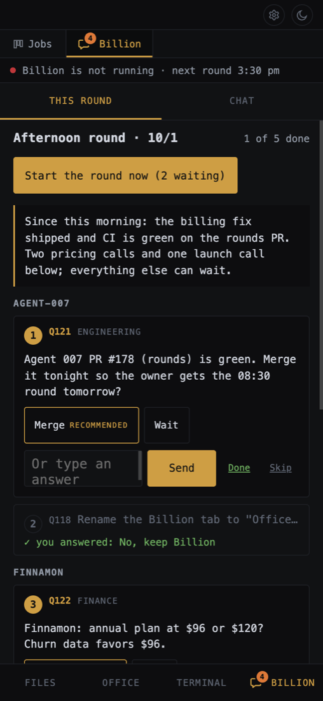
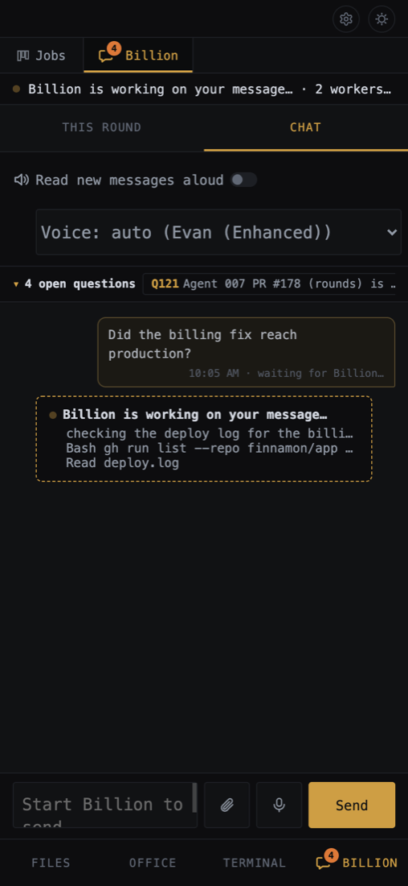

# Billion — the one agent you talk to

Design notes, worked out step by step. Status: **built** (parts 1–4, Codex
approvals included, and the charter split).
Builds on PR #92 (orchestrator charter template and guide).

## Idea

The last step of the progression: once the job board runs work without you
watching, Billion stops you having to post the jobs too. Give it a goal and it
runs the board.

Borrowed from Munder Difflin's orchestrator ("Michael"): one contact point. You
talk to Billion; Billion posts job cards, directs workers, and approves or denies
their permission prompts. It escalates only what needs you.

## Step 1 — the server starts Billion

Decided:

1. **On by default**, with a setting to turn it off.
2. **Repo:** `~/.agent-007/billion/` (under `CONFIG_DIR`, so tests that redirect
   `AGENT007_CONFIG_DIR` never touch the real one). Override with `BILLION_DIR`.
   First run: `git init`, copy Billion's templates (`charter.md` →
   `CHARTER.md`, `owner.md` → `CLAUDE.md`, plus `STATE.md` and `COMPANY.md`),
   commit. Already there: just use it (the charter is refreshed on every
   start; see "Charter upgrades").
3. **Runs without permission prompts** (`--dangerously-skip-permissions`): it
   works all the time and must never block on a dialog.
4. **Server restart resumes it**: `claude --continue` when the folder has a
   previous session. Memory files cover whatever the conversation loses.
   A resumed conversation keeps the board tool definitions it first loaded
   (Claude Code pins them in the transcript), so each start saves the current
   ones to `billion-tools.json` in the config folder, and the restart prompt
   names any that changed since the last start and points there. Its habits
   outlast a re-read charter too, so each start also saves the charter to
   `billion-charter.md` in the config folder, and a resumed conversation's
   prompt quotes the paragraphs that changed (past 40 lines, only their
   sections' names). With no saved copy yet, it quotes the charter's
   paragraphs on answering the owner in the tab rather than the terminal.
5. **No auto-restart** if it exits or crashes: show it stopped, with a Start button;
   start it again on the next server start.
6. **Fixed name "Billion"**, reserved. `send_message` addresses agents by name,
   so no other agent may take it. No cocktail codename.
7. **Placement:** top of the left panel (above the repo groups, not under
   "(no repo)"), top center of the office on its own desk, and its terminal
   running from the start, its tab in the right panel hidden until the owner
   clicks Billion (closing it hides it again).
8. **One Billion per server.** Messages only flow between agents with the same
   owner; per-user Billions wait until someone runs multi-user.

Existing code to lean on: repo-less agents already run (`server/pty.js`
`createSessionFromConfig`, cwd falls back to home), are listed under "(no repo)"
(`public/modules/explorer.js`, the "(no repo)" section), and sit in a final pod
(`public/modules/office.js:156`). Billion is a repo-less agent whose cwd is its
own folder.

## Step 2 — Billion approves workers' permission prompts

Decided: workers keep asking for permission; Billion answers. Both CLIs have a
`PermissionRequest` hook with the same shape:

- Input on stdin: `tool_name`, `tool_input`, `cwd`, `session_id`, ... .
- Output: `{"hookSpecificOutput": {"hookEventName": "PermissionRequest",
  "decision": {"behavior": "allow"}}}`, or `"deny"` with a `"message"`.
- **No decision printed → the normal dialog appears for a person.**
- Codex: `updatedInput` / `updatedPermissions` / `interrupt` are reserved and
  fail closed (deny). Don't use them.

Flow:

1. At spawn, the server adds the hook: `--settings` for Claude Code, a `-c`
   override for Codex, the same way the board MCP server is added
   (`server/agent-mcp.js` `withMcpConfig`). It is added to argv after the fact,
   so `isUnguarded` (which reads the typed command) still sees the worker as
   guarded.
2. The hook sends the request (tool, input, agent, repo, branch) to the server
   and waits.
3. The server hands it to Billion; Billion answers with a new MCP tool
   `answer_permission {id, decision: allow|deny|owner, reason}`. A deny
   reason goes back to the worker; owner leaves it to you.
4. **No answer within ~2 minutes, or Billion not running → no decision**, so
   the dialog appears for you. Never allow by default.
5. Actions under the escalation rules (destructive, paid, secrets, ...):
   Billion deliberately gives no decision
   and tells you why in its terminal.

Constraints and consequences:

- **Hook timeouts:** both CLIs limit how long a hook may run. Set that limit a
  little above the 2-minute wait, or the CLI gives up first and counts it as a
  deny.
- **Messaging rule must change.** Today guarded agents cannot message an
  unguarded one (`server/messages.js` `messageableAgents`), which would cut off
  approvals and "done" reports. Exempt Billion as a recipient. Accepted cost: a
  worker that read untrusted text can pass instructions to an agent with full
  access. Messages are labelled "from another agent, not the user" and the
  charter says to treat them as information — an instruction, not a sandbox.
- **Billion can hold up the workers.** Messages reach it only while it rests
  at its prompt, and every approval takes up its conversation and tokens.
  Start with Billion answering directly and log how long approvals wait. If
  waits get long, answer approvals with a separate `claude -p` call that uses
  Billion's charter, and give Billion only a summary.

### Codex hook trust (resolved)

Codex runs a hook only once its hash is trusted in `~/.codex/config.toml`
(`[hooks.state]`), or when launched with `--dangerously-bypass-hook-trust`
(which applies to that session only).

- If Codex loads hooks only from `~/.codex/` and `-c` overrides → **use the
  flag.** Simpler, and no trust prompt that Billion can't answer.
- If Codex also loads hooks from the project (`.codex/` in the worktree or a
  parent) → the flag would run those unreviewed too. That covers repos you
  didn't write, and a worker that writes a hooks file into its worktree turns
  "write a file" (which approval covers) into "run any command" on the next
  re-spawn (which it doesn't). Then instead: approve once in Codex's own
  "Hooks need review" prompt, with a **stable hook command**
  (`~/.agent-007/hooks/permission-request.js`, port passed by env var) so the
  hash doesn't change across runs, worktrees and ports. The app already
  recognises that prompt (`lib/helpers.js:96`), so Billion won't answer it.
- Not writing the hash into `~/.codex/config.toml` ourselves: agent-007 has
  not changed the user's permanent CLI config so far.

Question sent to the other agent (codex-cli 0.156.1; Codex is not installed on
this machine):

> 1. Besides `~/.codex/hooks.json` (and `~/.codex/config.toml`) and `-c`
>    overrides, does it load hooks from the project, e.g. a `.codex/` directory
>    in the working directory, the git root, or any parent?
> 2. If so, are those under the same `[hooks.state]` hash trust, and does
>    `--dangerously-bypass-hook-trust` skip review for them too?
> 3. Does a project's `.codex/` load only when the project is marked trusted
>    (`[projects."<path>"] trust_level`)? Is a git worktree of a trusted repo
>    the same project, or a new, untrusted one?

Answer (other agent, 2026-09-24; tested against the installed 0.156.1 binary
with a throwaway `CODEX_HOME`, file hooks only):

1. Project hooks load from every `.codex/` between cwd and the repo root
   (`hooks.json` and a `[hooks]` table in `config.toml`), never above the root.
2. They use the same `[hooks.state]` hash trust (key
   `<abs path to file>:<event>:<i>:<j>`). The bypass flag skips the hash check
   for project and user hooks alike.
3. Project hooks load only if the project is `trust_level = "trusted"` in
   `config.toml` (a `-c` override of that does not count). The bypass flag does
   not override this. A worktree counts as the same project, **and runs the
   main checkout's hook files, never the worktree's own** (trust keys use main
   checkout paths).

What that means:

- The "worker writes a hooks file into its worktree" risk is **gone**: those
  files never run.
- Untrusted repos are safe even with the flag.
- What the flag still exposes: in a *trusted* repo, a hook that lands in the
  main checkout (e.g. a merged contributor PR) runs without hash review.
- Their conclusion ("the hook must sit in each main checkout or
  `~/.codex/hooks.json`") assumes a file. We plan a `-c` override, which was
  not tested. That case decides the design.

Follow-up sent (all without the bypass flag):

> 1. A PermissionRequest hook supplied only via `-c`, no hooks file: does it
>    run with no `[hooks.state]` entry, or is it held for trust?
> 2. If held: what is its `[hooks.state]` key, and is it stable across cwds,
>    worktrees and repos (same hook command)?
> 3. Does a `-c` hook run in an untrusted project?
> 4. Does `hooks/list` show it, and with what source?

What each outcome means:

- Runs untrusted, in untrusted projects too → no flag, no approval. Best case.
- Needs trust, stable key → approve once (stable command, port by env var).
- Needs trust, key varies by folder → choose between the flag (accept the
  merged-PR risk above) and writing our own trust entry into `config.toml`.

Follow-up answer (other agent, 2026-09-24; app-server threads with
`approvalPolicy: "on-request"`, never the bypass flag; `codex exec` forces
`approval: never` so it can't test this):

1. A `-c`-only hook is **held for trust** without a `[hooks.state]` entry;
   with a trusted hash it runs and its allow is honoured. Stdin carries
   `tool_name`, `tool_input` (`command`, `description`), `cwd`, `session_id`,
   `turn_id`, `model`, `permission_mode`, `transcript_path`.
2. Key: `/<session-flags>/config.toml:permission_request:<group>:<hook>` — no
   cwd in it; identical across non-git folder, repos and a worktree. The hash
   covers the command string (exact, incl. the script's absolute path),
   `timeout` and `statusMessage`; not `matcher`. Position is in the key: a hook
   placed ahead of ours makes ours untrusted. **The trust entry can itself be
   passed with `-c`** (`hooks.state={"<key>"={trusted_hash="sha256:…"}}`).
3. It runs in untrusted projects and their worktrees: only per-hook hash trust
   applies, not project trust.
4. `hooks/list` shows it with `source: "sessionFlags"` and a `trustStatus`
   (untrusted / trusted / modified).

**Resolved: the best case, and better.** Each Codex spawn gets two `-c` flags:
the hook and its trusted hash. No bypass flag (repo hooks keep their review),
no hook file anywhere, nothing written to `~/.codex/config.toml`, no trust
prompt for you, works in every worktree.

Build rules:

1. Ours is the **only** `PermissionRequest` entry agent-007 passes (position
   is in the key).
2. The command never changes: as built, `"<node>" "<server/permission-hook.js>"`
   with no argument, fixed for the server's life. The worker's MCP config
   (board address and token, 0600) reaches the hook as a path in
   `AGENT007_HOOK_CONFIG`, set on that worker's PTY only; Claude Code's hook
   still takes it as an argument.
3. **Get the hash at startup from Codex itself**: run `codex app-server` with
   our `-c` hook and read it from `hooks/list`. Don't hardcode (the path
   includes the home directory) or reimplement the hashing (a Codex update
   could change it). Codex not installed → skip; no Codex workers to hook.
4. `timeout` above Billion's 2-minute wait; it's in the hash, so pick once.

Checked at build time (codex-cli 0.157.0, app-server turns with
`approvalPolicy: "on-request"` and a read-only sandbox, stub hooks, a scratch
`CODEX_HOME`): with the user's own `PermissionRequest` hook in
`~/.codex/hooks.json`, both run, side by side (keys `…/hooks.json:…:0:0` and
ours, `/<session-flags>/…:0:0`, so ours stays trusted). **A deny from either
wins**; failing that an allow from either stands; only when neither decides
does the dialog appear. So a user hook that denies overrides Billion's allow,
and a user hook that allows lets a request through that Billion left to the
owner. Our `hooks.state` flag merges into the user's `[hooks.state]`: their
own trusted hooks stay trusted.

## Step 3 — first run: introduction

Decided: on its first run (empty repo just created), Billion greets you with a
short self-introduction, then asks for the information it needs.

1. **The server decides it's the first run** (it just created the repo) and
   starts `claude "<first-run prompt>"` instead of `claude --continue`. If
   the app is closed partway through, the next start resumes with
   `--continue`; the charter says to finish the introduction while
   `STATE.md` still says "not started".
2. **Ask only what it can't look up.** Repos, agents and cards it finds
   itself (board tools, file system). **Decided:** a one-sentence
   introduction, the escalation rules (so you know what it will bring to you,
   and can change them), then two questions — the mission, and where new repos
   go.
   Everything else uses defaults and can be changed by telling Billion later.
   Example:

   > Hi, I'm Billion. I run the work here: I turn a goal into a plan, hand the
   > pieces to workers on the job board, review what comes back, and merge it.
   >
   > I decide most things myself. I'll come to you before anything that:
   > - spends money;
   > - needs access I don't have (accounts, keys, logins);
   > - can't be undone, like deleting data or repos;
   > - makes a private repo public (its whole history goes public, including
   >   anything ever committed);
   > - touches payments, pricing, security or secrets;
   > - is a real fork in direction that's yours to call.
   >
   > If you want that list different, just tell me, now or any time.
   >
   > If you don't give me a goal, I'll look for improvements across your
   > projects and work on those. Do you have a specific mission in mind? It
   > can be as narrow as "ship the Windows build of agent-007" or as broad as
   > "grow the company".
   >
   > And when I start a new project, where should its repo go? Your projects
   > seem to live in `~/Projects/`. Shall I use that?

   After your answers, it closes with where everything lives:

   > Got it. Everything I know is in `~/.agent-007/billion/`: my rules in
   > `CLAUDE.md`, the mission and what we learn in `COMPANY.md`, and my
   > current plan in `STATE.md`. Every change is a commit there. Ask me to
   > change any of it, any time. Starting now.

   The suggested folder is worked out from the repos already added (their
   common parent), not hardcoded; with none, it just asks. Where answers go:
   the mission (or "none, find improvements") → `COMPANY.md`; the projects
   directory → `CLAUDE.md` (an operating rule, like the escalation list,
   which also lives there and changes there if you ask). Then commit,
   `billion_ready`, start the loop.
3. **It never contacts your agents.** It manages work, not agents: it
   messages only the workers of its own cards and leaves agents you started
   alone, so there is nothing to ask (replaces PR #92's "message every running
   agent" first cycle). No messages during the introduction is covered by
   point 4.
4. **Billion's message queue holds until the introduction is done.**
   `server/messages.js` already queues per agent (cap 20), delivering only
   while the recipient rests at its prompt, not within 30 s of a person
   typing, one per stop. That alone isn't enough: during the introduction
   Billion rests at its prompt waiting for *you*, so the queue would deliver
   into your conversation. Add one condition to the "may I deliver now?"
   check: nothing goes to Billion until it calls `billion_ready`.
   - Messages (worker questions, `finish_job` notices) wait and arrive after
     the introduction. Nothing is lost.
   - Approvals get no decision straight away while the inbox is held, so the
     dialog goes to you at once.
   Rare in practice: after a restart only the board starts workers (its
   running state is saved; first check 2 s after boot, `server/jobs.js`
   `startDispatcher`), and a new install has an empty board.
5. **The loop starts right after the introduction**, in the same
   conversation. Later starts: `--continue`, then straight into the loop.

## Template files

The templates themselves, in `templates/billion/`, are the authority; the
copies quoted below are how they were designed and may have drifted in wording.

Billion's own `templates/billion/`, starting as a copy of PR #92's
`templates/orchestrator/` (merge #92 as the general template; don't couple
Billion's behaviour to a file others edit for their own orchestrators). Copied
into `~/.agent-007/billion/` on first run.

### The files at a glance

- **`CHARTER.md` — how Billion works, as Agent 007 ships it.** Role, cycle,
  principles, escalation list, tools and limits. Rewritten by the server on
  every start; Billion never edits it.
- **`CLAUDE.md` — the owner's rules.** Imports `@CHARTER.md`, then the
  owner's settings and rules (e.g. where new repos go), which take
  precedence. Changes only when you ask. Loaded automatically by Claude Code
  at session start (with the charter) and kept through compaction.
- **`COMPANY.md` — what's true about the company.** *Mission* (your words; only
  you change it) + *What we know* (Billion: projects, customers, numbers,
  lessons). Changes when something is learned. **Not imported** (it grows,
  and an import would put all of it in every turn, approvals included). A
  pointer in `CLAUDE.md`; read at the start of every cycle, so the mission is
  in front of Billion whenever it plans, and reloaded after compaction. **Kept
  as an index:** a line or two per project pointing at the project's repo
  (README / `NOTES.md`), where the details live; only cross-project things
  (mission, project list, customers, key numbers, lessons) stay here.
- **`STATE.md` — what's happening now.** Plan, waiting on you, short-term
  notes. Rewritten every cycle. Read explicitly at the start of every cycle,
  not imported (an import is read once per session and this changes every
  cycle). After a restart it's the handoff note.

All of this — what each file is for, when it's read, and the boundary test —
goes into `CLAUDE.md` itself, the one file guaranteed to be in context.

Boundary test for Billion:

- A rule the owner gave me? → `CLAUDE.md` (Agent 007's rules are in `CHARTER.md`, read-only)
- A fact that will still matter in a month? → `COMPANY.md`
- About what's happening now? → `STATE.md`
- A card's status or full result? → the board
- Why I decided something? → that cycle's commit message

### `charter.md` (→ `CHARTER.md`)

Billion is a founder: it runs the company, not just the office. It turns a
statement into a plan and the plan into cards.

- **The statement:** free text from you, kept in `COMPANY.md`. Anything from
  "build an app that does X" to "improve the company". Limits you want (money,
  time, how many projects) go in the statement too.
- **The cycle, always the same:** read `COMPANY.md` and `STATE.md` → check status (what has
  been done, its cards and PRs, worker reports and questions, pending
  approvals) → make or update the plan → post cards → commit → schedule the
  next wake-up. Everything else — start a project, research, build, drop — is
  a decision inside the plan, not a step in the cycle.
- **`STATE.md` holds the plan and status**, rewritten every cycle. The
  decisions and why go in each cycle's commit message. With `CHARTER.md`,
  `CLAUDE.md` and `COMPANY.md`, that is all of Billion's files.
- **It manages work, not agents.** It posts cards, follows them with
  `list_jobs`, and messages only the workers of its own cards. Agents you start
  by hand are yours. Throughput is capped by the board's `maxPerRepo`.
- **Tools and limits:** as in #92, plus Billion's own `billion_ready`,
  `add_repo`, `close_job` and `answer_permission`, and `read_agent_screen`:
  the last lines (default 40, at most 200) of a worker's terminal, ANSI
  stripped, with its status. Narrower than `send_message`: only workers on
  Billion's own cards, never an agent started by hand, since a screen can show
  a secret that scrolled by. The text is never logged, and reaches Billion
  quoted and labelled as untrusted.

Principles (the charter gives these, not procedures):

- **Every project is a repo, from the first research onwards.** Research,
  drafts and code for a project all live in its repo; Billion's own repo holds
  only its memory. A new repo needs a remote and a pushed `main` before its
  first card (workers branch from the remote base; PRs need a remote), and
  `add_repo` so the board knows it (today `post_job` rejects unknown repos,
  `server/jobs.js:333`; `add_repo` wraps `addRepo`, `server/git.js:173`).
  Private by default.
- **Check results, not claims.**
- **Billion reviews and merges its PRs.**
- **Escalate** money, missing access, irreversible steps, payments /
  pricing / security / secrets, making a private repo public (its whole git
  history goes public), and strategic forks. Going public is **not** an
  escalation on its own: publishing posts, changing the website, launching,
  emailing people are Billion's call. A merge escalates when it touches payments, pricing,
  auth, secrets or data deletion.
- **Archive, never delete.**
- Money and safety sections: as in #92.

Practical note for the charter: check `baseRefName` and retarget stacked PRs
to main before merging. Machine-specific quirks (which `gh` account can write,
for example) are not in the template; Billion learns them and keeps them in
its own `CLAUDE.md`.


Projects directory for new repos: asked in the introduction (step 3).

### `STATE.md`

Decided. Billion's working memory between cycles: read first after a restart,
rewritten whole every cycle, readable by you. The board already records every
card Billion posted (`postedByBillion`, set from the posting session in
`server/jobs.js` `postJobForAgent`; `postedByAgent` is only the display name)
with its status, PR and summary, so none of that is copied here —
it would go stale. `STATE.md` holds only what the board can't know.

```markdown
# STATE

Rewritten every cycle; keep it to one screen. The board is the record of my
cards and their results. This file is what the board can't know.

Status: not started

## Plan
Next steps toward the statement in COMPANY.md, in order. Add the card id once
a step is posted. Group by project when there is more than one.

## Waiting on you
Escalations: what, why, what I recommend, asked when.

## Notes
Short-term only: what the next few cycles need. Anything that will still matter
in a month goes in COMPANY.md.
```

- **Status:** "not started" until the introduction is done (step 3's marker);
  then a line or two on the current focus.
- **Plan:** next steps in order; the order is the priority. Posted steps carry
  their card id. Finished steps drop out; the commit history keeps them.
- **Waiting on you:** open escalations, each with a recommendation.
- **Notes:** short-term only ("recheck card 118 after the retry"). Anything
  that will still matter in a month goes in `COMPANY.md`; full results stay on
  the card.

Example of an active one:

```markdown
Status: Validating a CLI for agent cost reports; building agent-007's close_job tool.

## Plan
agent-cost (new repo, ~/Projects/agent-cost):
1. Market research: who tracks agent spend today (card 118, in progress)
2. Decide build or drop from 118's result
agent-007:
1. close_job tool (card 119, in Review, reviewing the PR)
2. Notify the poster on finish_job

## Waiting on you
- Buy agentcost.dev ($12/yr)? Needed only if we build. Recommend: wait for card 118. Asked 14:20.

## Notes
- Card 118's first run hit a rate limit; recheck its summary before deciding.
```

### `COMPANY.md`

Decided. The company's lasting memory: your mission plus what Billion learns
that outlasts a cycle. Uppercase to match `CLAUDE.md` and `STATE.md`.

```markdown
# Company

## Mission
<your statement, in your words; only you change this>

## What we know
Maintained by Billion. Facts that outlast a cycle:
- Projects: each one's repo, what it's for, its stage, where its research lives.
- Customers and channels: who uses what, where they came from.
- Numbers that matter: users, revenue, costs.
- Lessons: what worked, what didn't, and constraints (e.g. the board runs
  one worker per repo).
```

The split: `COMPANY.md` = what stays true (changes when something is
learned); `STATE.md` = what's happening now (changes every cycle); the board =
every card and its full summary. Billion's test: "would this still matter a
month from now?" → `COMPANY.md`. One file rather than a separate
`MISSION.md`: the mission is one paragraph, marked as yours.

### `decisions.md` — dropped

Decided. Each cycle's commit message is the decision log: git history is
already append-only and timestamped, and a separate file would have to be kept
in step with it. Billion reads recent decisions with `git log -10`; you read
them with `git log` in its repo. The card id replaces #92's "who" field.
Example:

```
cycle: start agent-cost; drop the browser-extension idea

- Started agent-cost: three users asked for per-agent spend reports (card 112).
- Dropped browser extension: research found 4 free competitors (card 107).
- Merged #119 (close_job): reviewed, CI green, no escalation items.
```

## Board changes on main (v0.4.8.0 #91, v0.4.9.0 #93) and what they change

- Workers finish with `finish_job` (PR URL, or a summary for `requires_pr:
  false` cards) → card to Review. Review keeps the agent until Done, so
  Billion can question a worker before merging. Schedules post a run card per
  firing and never flood the board.
- Research results come back as **card summaries** (`read_job`), not files.
  `STATE.md` Notes keep only conclusions, never copies of summaries.
- "Report back to Billion" in every card is **dropped**: `finish_job` is the
  report. Built: when one of Billion's own cards reaches Review, the server
  sends Billion a notice, so it wakes at once. A server notification isn't
  agent-to-agent, so the guarded/unguarded rule doesn't apply; the messaging
  exemption is now needed only for worker questions and replies.
- **Gap: Billion can't close a card that has no PR.** PR cards close on merge;
  a no-PR card waits in Review for Done, which only the UI can do. Needs a
  tool (e.g. `close_job`: accept → Done, or reject → back to To do with a
  note), or Review fills with idle workers.
- Recurring work → a schedule card Billion posts once.

## GitHub accounts

The owner may be signed in to more than one gh account (say one for personal
repos and one for an organisation's), each unable to see the other's repos.
`gh auth switch` changes the active account for the whole machine, so one
agent switching it breaks every other agent and the owner's shell until someone
switches back. Nothing in Agent 007 switches it:

- A board worker spawned (or re-spawned onto its card) in a repo with a github.com remote gets `GH_TOKEN` for the
  account that can see it (the account named like the repo's owner, else the
  first whose token can read `repos/<owner>/<name>`), remembered per repo for
  the server's lifetime and re-checked at each spawn. Git's credential helper
  for github.com is pointed at `gh auth git-credential` through
  `GIT_CONFIG_*`, so `git push` uses the same account. The token is in the
  worker's process environment, the same exposure as before (a worker could
  always run `gh auth token`), and is never logged. hosts.yml is never written.
- Claude Code workers are spawned with deny rules for `gh auth switch`,
  `gh auth login` and `gh auth logout`, which hold in every permission mode;
  every worker's card prompt says never to run them (Codex has no deny rules).
- The board's own gh calls (PR lookups, CI notices) pass each account's token
  per call and remember which one answered for each repo.
- Billion works across repos, so its charter says to pick the account per
  command: `GH_TOKEN=$(gh auth token -u <account>) gh …`.
- `agent-007 doctor` names the account board workers use for each GitHub repo
  on the board, and marks ✗ a repo no signed-in account can see.

## Claude Code or Codex

Billion runs on Claude Code by default, or on Codex with `BILLION_AGENT=codex`.
The button next to Billion's name in the left panel switches it to the other
one, and the server switches it by itself when the CLI it runs on hits its
usage limit (below).

- **Which one.** `BILLION_AGENT` in `.env` is the default. A switch is saved in
  `~/.agent-007/billion-agent.json` together with the `BILLION_AGENT` it was
  made under, and holds across restarts until that setting changes: an edited
  `.env` is the newer word, so it wins again. An automatic switch can then
  change the CLI without touching `.env`.
- **Codex's launch.** `codex --dangerously-bypass-approvals-and-sandbox` in
  Billion's folder, with the board MCP server and the folder's trust passed as
  per-run `-c` overrides (never written to `~/.codex/config.toml`), like a
  board worker. A restart resumes Codex's newest session in that folder by id
  (`codex resume <id>`, never `--last`). Without `codex` on the PATH its tab
  says how to install it, as it does for `claude`.
- **Instructions.** Codex reads `AGENTS.md`, not `CLAUDE.md`, and follows no
  `@`-import, so the server writes `AGENTS.md` on every start: the owner's
  `CLAUDE.md` with its `@CHARTER.md` line replaced by the charter. The owner's
  rules stay after the charter, where they say they take precedence, and
  `CLAUDE.md` itself is only read. Only `@CHARTER.md` is expanded.
- **The loop.** Codex has no `/loop` or ScheduleWakeup, so on both CLIs the
  server drives the loop (`server/billion-wake.js`). It types `Run one
  operating cycle as defined in CHARTER.md.` into Billion's terminal every 30
  minutes, every 3 while its work is moving (a worker on one of its cards
  running, by the board's own status, or a card that reached Review or
  finished CI since the last wake; a stalled, waiting, needs-you or gone
  worker does not count, since each wake re-reads Billion's whole context),
  or when Billion asked with `set_next_wake` (3 to 60 minutes, the next wake
  only). Never mid-turn: only when Billion rests at its prompt, the check mail
  delivery uses, with its inbox open and no mail waiting. Never within 2
  minutes of the owner typing in its terminal. The charter tells Billion not to
  run a loop of its own, so a Claude Billion is not driven twice.
- **The handover.** A switch writes `HANDOVER.md` in Billion's folder, stops
  the running Billion (its waiting mail moves to the new one), and starts the
  other CLI in a new conversation whose first prompt says to read `STATE.md`
  and `HANDOVER.md` first. `HANDOVER.md` includes up to 80 recent dialogue and tool entries of the old
  CLI's newest conversation in that folder as plain text (from
  `~/.claude/projects/<folder>/*.jsonl` or `~/.codex/sessions/...`), with no
  model involved, plus pointers to `STATE.md`, `git log -10`, and the original
  transcript. Entries are bounded to about 8,000 characters each and 96,000
  total; truncation is explicit. A failed handover write cancels the switch.
  `agent-007 handover` writes one on demand. The new CLI starts fresh rather
  than resuming its own older conversation, which would be out of date.
- **Not committed.** `AGENTS.md` and `HANDOVER.md` are listed in the repo's
  `.git/info/exclude`. `AGENTS.md` is made from two committed files, so it
  would only repeat them. `HANDOVER.md` is raw conversation, which can hold
  whatever the owner typed, and is replaced at every switch.
- **Across a switch** the inbox, the *Billion* tab, Telegram and the
  board tools keep working: all of them find whichever Billion is running.
  Permission requests waiting on the old Billion go to the owner, as they do
  when Billion stops.
- **Usage limits** (`server/billion-limit.js`, off with
  `BILLION_AUTO_SWITCH=0`). Every 10 seconds the server reads the bottom 15
  lines of Billion's screen, and only Billion's, for the CLI's own limit
  notices: Claude Code's `You've used 92% of your weekly limit · resets …`,
  `You've hit your session limit …`, `You've reached your Fable limit`,
  `You're out of usage credits …`; Codex's `Heads up, you have less than 25% of
  your weekly limit left`, `You've hit your usage limit …`, `You're out of
  credits`. At a warning past 75% and again past 90% it types, while Billion
  rests at its prompt, `Your <CLI> usage is at N%; bring STATE.md up to date
  and commit now, in case you're switched.` At a hard limit, once Billion has
  printed nothing for 5 seconds, it switches to the other CLI as the button
  does, saves the reason in `billion-agent.json`, logs one line and tells the
  owner through `tell_owner`'s rule below (a browser notice when it does not
  reach the phone). It never switches back
  on a timer, and never twice within 30 minutes: a limit on the new CLI that
  soon, or a target CLI that is not installed or not logged in (`claude auth
  status --json`, `codex login status`), leaves Billion where it is and puts
  `Billion paused: both Claude Code and Codex are at their limits` in the
  *Billion* tab and on Telegram, once, until a new Billion starts.
  **Claude account rotation** (`server/account-rotation.js`) comes first when
  enabled in Settings (on by default once two accounts are added; saved off
  settings stay off). Limits on Billion or managed Claude workers mark the
  shared login limited, and the app selects the next included account. It
  stops and resumes its Claude sessions on their exact conversation IDs,
  changing only authentication. Account order, cooldowns, active identity,
  refreshed credentials and recovery state persist across server restarts.
  With every selected account unavailable, workers wait; Billion can fall
  back to Codex if enabled. Without fallback it retries after the earliest
  known reset or a 30-minute backoff. Returning from Codex first selects an
  eligible Claude login and then uses the normal conversation handover.
  Billion's repository and state files stay in the same place throughout.

## Rounds

The owner, 2026-10-01: too many questions, a chat that takes a long time to
answer without saying what is going on. So Billion comes to the owner twice a
day, not whenever a question occurs to it.

**When.** Two rounds a day, 08:30 and 15:30 in the owner's time zone. In
`~/.agent-007/config.json`: `rounds` (`["08:30", "15:30"]`; `[]` turns rounds
off and every question shows at once, as before), `roundMaxPerProject` (2)
and `roundsTimeZone` (an IANA name such as `"America/New_York"`; the server's
own zone when unset). Read at startup.

**Queue.** `notify_owner` no longer shows a question: it queues it under its
`project`, which is the department. Its result says where it stands: "Queued
as Q12 for the 15:30 round (10/1 pm), position 1 of 2 in agent-007", or
"position 3 … behind the top 2" when two are ahead of it. Queued questions are
never sent to a browser. Billion manages the queue with `list_round_queue`
(per project, in the order the round takes them), `drop_queued` (number or
id) and `notify_owner`'s optional `rank` (1 first).

**Release.** At round time the server (`server/rounds.js` for the clock,
`releaseRound` in `server/owner.js`) takes, per project, the two
highest-priority queued questions: blocking, then normal, then low; then
`rank`, a ranked one before an unranked one; then the newest. Those open in
the tab and the thread. Every question the previous round released that is
still open is **consolidated**: status `consolidated`, kept in history (the
tab's *Earlier*), off the open list and the badge, and no longer answerable
(Telegram buttons on it say so). Questions past two per project stay queued
for a later round. A round that comes due while the server is down is
released once when it starts. Billion hears it in its terminal as one line:
`[Owner round] Round 10/1 pm released 5 (Q120, …); consolidated Q118, Q119:
re-queue only if still top two; 3 still queued for later rounds
(list_round_queue to re-rank or drop).` (kept in `rounds.json` until Billion
runs). The owner's phone gets ONE Telegram message per round, "Afternoon
round: 5 items across 3 departments", with Billion's brief and a link to the
app (`APP_URL`, else the first `ALLOWED_ORIGINS` entry), never one per
question.

**Numbers and Done.** Every item in a round carries a short number, 1, 2,
3…, in the order the tab shows them (*Needs you now* first, then each
project); an emergency asked during the round takes the next number. The
owner clears items with a card's *Done*, or by typing `1d` (`1d 3d`, `1d, 3d`)
in the chat box, in any card's reply box, or on Telegram. Each becomes
answered "done" (it folds as *✓ done*) and Billion reads one line:
`[Owner via app] item 1 done (Q12: "..."); item 3 done (Q14: "...")`. A
number with no open item in this round is reported back and the rest still
go. Like an answer, it needs Billion running.

**Start the round now.** *Start the round now (N waiting)* at the top of
This round, or the owner typing "start the round now" (also "start round",
"release the next round") in the chat or on Telegram, releases the next
round immediately, with the same two-per-department rule and the same
consolidation. That round's time is then used up, so the clock does not
release it again, and "next round" moves on to the one after. These two
commands are handled by the server and are not typed into Billion's terminal.

**Brief.** `set_round_brief` (up to 600 characters) is shown at the top of
the round and in its Telegram message: for the next round by default, or
`round: "current"` for the one on screen.

**Emergencies.** `urgency: "blocking"` or `telegram: true` is the only way to
the owner outside a round: it shows at once (in *Needs you now* at the top of
the round) and goes to the phone as before, under the per-minute limit. A
blocking question with `telegram: false` waits for the round, first in its
project. The tool description says this is for true emergencies only.

**First start.** The first time a server with rounds starts, every open
question except blocking ones is consolidated and Billion is told which, so
it can re-queue the ones that still matter; the round that already passed
that day is not released on the spot (`rounds.json`: `migratedAt`, `lastAt`,
the round on screen and its brief, a note waiting for Billion).

**The tab.** The Billion tab opens on **This round**: a status line, the
round's name and a counter ("3 of 7 done"), the brief, then one section per
project with at most two cards. Each card is the question, its tap choices
(recommended first), a reply box with Send, and *Skip* (dismiss). An answered
card folds to one line where it stood ("✓ you answered: …", *Undo* for a
minute). Nothing reorders or jumps while the owner reads or types: a card is
updated in place, and when the set of cards changes the view keeps its
scroll position, the drafts typed in reply boxes and the focus. *Earlier*
(closed by default) lists what past rounds consolidated or got answered. The
chat thread moved to the second view, **Chat**, unchanged; the browser
remembers which view was last open.



**The owner's messages and the progress box.** What the owner types is never
queued: it reaches Billion at once. Each message stays *pending* ("waiting
for Billion…") until a `tell_owner` answers it, oldest first, so two
messages sent before a reply each get their own (the reply carries `replyTo`,
the message it answered). A server notice (an account switch) answers none.
Each pending message has its own bounded **progress box**. Only the oldest
request receives Billion's `set_status` summaries; later messages wait for
that reply. Use short, owner-facing summaries of the current step, evidence
or findings, uncertainty or blockers, and the next check (140 characters per
update). The last three summaries are kept; consecutive duplicates are ignored. Private reasoning,
terminal output, tool calls/results and command arguments are never read by
the progress stream. The configured Telegram token is redacted before storage.

When `tell_owner` binds the answer, the live box disappears immediately and
its summaries become a small, closed **Work details** disclosure under that
answer. Empty progress adds no disclosure. The owner can expand it, and
ordinary updates leave it expanded. The existing status stream updates the
box; there is no separate polling or transcript stream.

Request markers and summaries are stored with the chat so new requests keep
their oldest-first reply bindings across reconnects and server restarts.
Messages written before request markers existed are not guessed into the queue.
After an hour without a reply, while Billion is stopped, or while the browser is disconnected, the active box
is hidden. A late answer still binds to its original request; an activity
timeout never shifts an answer to a newer message. A waiting CLI shows no
animated activity dot. Worker updates and server notices do not close a request.



*Earlier layout shown above: progress now sits inside each pending message,
uses explicit summaries, and folds under the answer as Work details.*

**Status line.** One line at the top of both views: what Billion is doing and
what is running, "Working: reviewing PR #120 · 3 workers running · next round
3:30 pm". Billion sets its part with `set_status` (up to 140 characters;
gone after 30 minutes without an update); the server adds "Thinking…" while
Billion's terminal is mid-turn, the number of running workers on Billion's
cards and the next round. From the moment the owner sends a message (in the
tab or on Telegram) until its `tell_owner` reply, it says "Billion is
working on your message…" while the CLI is working, or "Waiting for Billion
to reply…" while it waits (for at most an hour). A disconnected browser says
"Reconnecting…" and clears active progress until the connection returns. It is
the owner's, like the chat: sent to the owner's browser only.

## Telegram

Billion's terminal is its work log: board notices, worker messages and cycle
prompts are typed in there all day, and a conversation with the owner gets
buried. So the owner talks to Billion in the **Billion** tab next to Jobs (a
chat bubble and "Billion", the tab a page opens on, badged with the count of open questions; on a phone, the
*Billion* button in the bottom bar): a chat thread, the web twin of the
Telegram channel. Billion's `notify_owner` questions, its `tell_owner`
replies and your messages, from the tab and from Telegram, are one
conversation there, newest at the bottom; the last 500 messages are kept in
`~/.agent-007/chat.json`, with open questions and unanswered owner requests
retained until answered. Open questions also pin to a strip at the top of
the tab ("7 open questions ▾", blocking first, then oldest). The strip is one
button: tap it (or the tab's badge) and the **Open questions** panel slides
over the thread, one section per project with its open count, the project
with a blocking question first, then the one whose question has waited
longest. Each row is a question's urgency mark, Q-number, first line and age,
with its choices (recommended first) and *Reply*, which sets the box below to
answer it; tap a row's text to jump to its bubble. × or Esc goes back to the
chat; on a phone the panel fills the screen and *Reply* closes it. The first
time the strip shows it says "tap to see all", and the browser remembers
whether the panel was open. Billion names the project with `notify_owner`'s
`project` (a repo's folder name on the board, or `general`); left out, the
server reads it off a GitHub URL or a repo's name in the text, else
`general`. A name not on the board is kept, lower-cased. A switch at the
top of the panel, *by project | by type*, regroups the same rows by the
question's `type` (engineering, marketing, outreach, finance, product, admin
or other): Billion passes it to `notify_owner`, a name off the list reads as
other, and left out the server reads it off the text, first match winning
(money, a `$`, price, plan, subscription, renew or pay is finance, so it
wins over the rest; a PR, CI, merge, deploy, bug, test or release is engineering; a reply,
LinkedIn, an email from, a DM or inbound is outreach, even about a post; a
post, Reddit, HN, a newsletter, tweet, a capital X, Changelog or launch is marketing;
a login, token, account, access, credentials, setup or install is admin; a
feature, design, UX, roadmap or direction is product). A question saved
before types existed gets one read off its text the first time the list is
read, and keeps it. Every section starts
closed, a header with its name, count, "!" when a blocking question is
inside, and a chevron; tap it to open. The browser remembers the grouping
and which sections are open. When Billion
cannot talk yet, a bar above the text box says why, with the button past it:
its CLI is missing (Start), Billion is stopped (Start), or `claude auth status`
/ `codex login status` said it is logged out, so it sits at the CLI's own
sign-in (open its terminal). The server clears that last one at `billion_ready`
or when that Billion exits.

Type in the box at the bottom (Enter sends, Shift+Enter is a new line) and it
is typed into Billion's terminal as `[Owner via app] <text>`, as a turn of its
own, while mail keeps flowing to it as before, even while questions are
open: typing never answers a question you did not pick. To answer one by
typing, tap *Reply* under it (or on its row in the Open questions panel): the box then says
"Answers Q3" (× goes back to a plain message). If Billion is not running the
message is refused and stays in the box.

There is no practical length limit on what you type or paste, in a message or
an answer: it reaches Billion whole, line breaks kept, as one turn (only a
paste over 200,000 characters is refused, with the text left in the box), and
the thread shows it whole in a scrollable bubble. Telegram itself caps a
message at 4,096 characters and a caption at 1,024, so Billion's longer
messages to your phone go as consecutive messages instead of being cut, and a
question's answered copy that no longer fits gets the rest as a follow-up
message.

To show Billion a screenshot or a file, paste an image into the box, drop
files anywhere on the tab, or pick them with the paperclip beside the mic.
They wait as chips above the box (× removes one) and go with the next Send,
with or without text. Each is saved owner-only (files 0600, folders 0700) in
`~/.agent-007/chat-files/<message id>/`, under the job form's limits (10MB a
file, 20 files and 50MB a message), and the turn ends with their absolute
paths: `[Owner via app] <text> (attached: /path/a.png, /path/b.pdf)`, or
`[Owner via app] Q3: <text> (re: "...") (attached: ...)` for an answer. Your
bubble shows images as thumbnails that open full size and other files as
download links; they are served only from that folder, never while user
accounts are on, and deleted when their message leaves chat history.
Unanswered owner requests stay past the 500-message cap.

With rounds on (the default, see [Rounds](#rounds)) a normal or low question
waits in Billion's queue until a round releases it, and the round sends one
Telegram message for all of them; what follows is how a question behaves
once it is in the tab, and how every question behaves with rounds off.
`notify_owner` puts each question in the tab. Only a **blocking** one also
goes to your phone, when a Telegram bot is set up: normal and low questions
wait in the tab (the thread, the open-questions strip and the badge) without
buzzing it. Billion can override that per question with `telegram`: `true`
pushes a non-blocking question it judges super urgent, `false` keeps even a
blocking one off the phone; left out, blocking goes and the rest stay. Its
tool result says which happened ("Put in the owner's Billion tab as Q12; not
sent to Telegram (urgency normal)"). A question that went to the phone can be
answered there, by button or reply; one that did not is answered in the tab.
Each question gets a short number, Q1, Q2 and so on. When the answer
is a pick, Billion passes `choices` (2 to 5 short answers) and marks the one
it `recommended`.

Replies and status updates that need no answer ("Got it, restart looks
clean") go through `tell_owner` instead: no numbered item, no badge, the same
per-minute limit. It always shows in the Billion tab, but reaches Telegram
only when your last message came from there, so a conversation in the tab
does not buzz the phone. The server remembers the channel of your latest
message (`[Owner via app]` or `[Owner via Telegram]`, answers included) until
it restarts; before your first message a `tell_owner` goes to the phone too,
so a status update still finds you away from the browser. Server notices
(account-switch results, a Billion switched at its limit) follow the same
rule. `notify_owner` questions follow their own rule above: blocking ones (or
`telegram: true`) go to both, the rest stay in the tab.

On Telegram the bot is Billion's own, so messages carry no name: a question
reads `Q3: <text>` (`! Q3: <text>` when blocking), a reply is its text alone.

When you answer a question somewhere else, say by typing in Billion's
terminal, Billion closes it with `resolve_question`: it moves to **Answered**
(marked *in the terminal*) and your phone's copy shows the answer, like any other.

Answered the wrong question? *Undo* sits beside "you answered: ..." for a
minute: the question opens again and Billion reads `[Owner via app] Q3: undo
my answer "..."`. After that, tell Billion; it puts the question back with
`reopen_question` (nothing is sent to Telegram).

Answer in the app: tap a choice under the question (the recommended one
first), or tap *Reply* and type in the box. The answer is typed into Billion's terminal as
`[Owner via app] Q3: <answer> (re: "<start of the question>")`, and the
buttons collapse to "you answered: <answer>". If Billion is not running the
question says so and stays open. Answered questions stay in the thread as
history; *Dismiss* closes one unanswered. With user accounts on (`users.json`) Billion does not run, and
nobody answers or dismisses for the owner. The list lives in
`~/.agent-007/waiting.json`; one written before answers existed still loads,
its items open and numbered in order.

Answer on Telegram: a question with choices arrives with a button for each.
Tap one, or *reply* to the question's message with text, and it reaches
Billion as `[Owner via Telegram] Q3: <answer> (re: "...")`; the message is
edited to show the answer and loses its buttons. An answer in the app edits
it too, to "Answered in app: <answer>". Whatever else you send the bot (a
message that is not a reply, a voice note) is typed into Billion's terminal
as `[Owner via Telegram] <text>`, the same way board notices and agent
messages arrive. If Billion is not running the bot says so and drops the
message.

Setup:

1. In Telegram, message **@BotFather**, send `/newbot`, and put the token it
   gives you in `~/.agent-007/.env` as `TELEGRAM_BOT_TOKEN=...`. Restart.
2. Send your new bot any message (or add it to your team's group and say
   something there).
3. The *Billion* tab shows `Telegram: a message from <name> (chat <id>). Use it
   for Billion?`. Check it is yours and press **Use this chat**. The bot answers
   "Connected to Agent 007." in that chat and the tab says *Telegram connected*;
   no restart.

`agent-007 doctor` checks the token: it says whether the bot answers, or that
Telegram rejects the token.

Every chat that messages the bot is offered, one by one (up to 20 a run), and
none is ever picked for you, so a stranger who finds the bot is just an offer
to *Dismiss*. Only the owner's browser sees the offers and can accept one: with
user accounts on, nobody can. The chat picked is kept in
`~/.agent-007/telegram-chat.json`. The Settings gear's *Telegram* line names the
connected chat; its **Change** forgets it, and the next chat to message the bot
is offered again (with nothing connected, the line gives the two steps above).
The offers are server state, so they stay through a reload until you act on them. `TELEGRAM_CHAT_ID` in the environment or `.env`
still works and wins over it; with neither, the server log also shows each
chat's id, for a server with no browser.

The chat id is the only gate: messages and button taps from any other chat are
ignored without a reply. The token is never logged or sent to the browser. 

**A group as the owner's chat.** A team can connect a Telegram group instead of
a private chat: every member of it counts as the owner (there is no per-member
allowlist). Their messages carry the sender's name so Billion knows who spoke:
`[Owner via Telegram (Alice)] <text>`, `[Owner via Telegram (Alice), voice] ...`
and `[Owner via Telegram (Alice)] Q3: <answer> (re: "...")`; the thread's bubble
reads *Alice on Telegram* and the question *Alice answered: Merge*. The name is
the member's first and last name, else their @username, cut to 40 characters
on one line with no brackets. A private chat is unchanged. By default a bot in
a group only receives commands and replies to its own messages, so turn its
privacy mode off: `/setprivacy` in @BotFather, pick the bot, *Disable*, then
remove the bot from the group and add it back. The server logs a hint when a
group has only sent it commands and replies.

Billion can notify
you at most five times a minute. No library: the server long-polls
`getUpdates` with Node's own `fetch`.

### Read aloud and dictation in the tab

For the car, or anywhere reading a wall of text is not an option. All of it
runs in the browser (`speechSynthesis` and the Web Speech API's
`SpeechRecognition`): free, no server work, no API key.

- **Read aloud**: every message from Billion in the thread (questions,
  `tell_owner` replies, server notices) has a speaker button. Tap it to hear
  the message; while it speaks the button is a stop square, and a second tap
  stops it. It reads plain words: markdown is dropped, links are read as
  "link", `Q51` as "question 51", `#160` as "number 160", a code block as
  "code block", and an open question ends with its choices ("Choices: Done,
  Not yet; recommended: Done"). Long messages are spoken sentence by sentence,
  so Chrome's cut-off after about 15 seconds of one utterance never truncates
  them. The voice is the best English one the browser lists (en-US first,
  Premium, Enhanced, Siri or Google voices before the rest); the picker at the
  top of the tab changes it and the browser remembers the choice.
- **Read new messages aloud**: the switch at the top of the tab (off by
  default, remembered by the browser). While it is on and the tab is showing,
  each new message from Billion is spoken as it arrives, one after another,
  never over each other. Browsers let a page speak only after a tap on it: the
  switch's own tap counts, but after a reload the tab shows **Resume reading**
  (with how many messages are waiting) until you tap it once. Leaving the
  Billion tab (or the phone's Billion view) stops reading.
- **On a phone**: reading goes on while the screen is on and the Billion view
  is showing. With the screen locked or the browser in the background, mobile
  browsers pause or drop page speech, so it is not reliable there; for that,
  use Telegram voice notes ([Voice](#voice)), which play like any audio
  message.
- **Dictate a reply**: the mic beside the text box. Tap it, allow the
  microphone the first time, and speak: the words being heard show greyed
  above the box, and each finished phrase is added to the box as text. Nothing
  is sent until you tap Send, so you can check or fix it first. If the box says
  "Answers Q3", the dictated text answers Q3 exactly like typed text. The mic
  has the terminal mic's limits: it stops after about a minute with no speech,
  always after 5 minutes, when the page is hidden and when you leave the tab;
  a red dot and the pulsing mic show while it listens. `Cmd+D` in the Billion
  tab toggles this mic. It needs HTTPS or localhost (see
  [REMOTE.md](REMOTE.md)), and most browsers do the recognition on their
  vendor's servers (Chrome and Edge: Google and Microsoft; Safari may do it on
  the device), so don't dictate secrets. The terminal's own mic is unchanged.

### Voice

A poor man's audio chat, free and on your own machine: nothing is sent
anywhere but Telegram, and there is no paid transcription.

- **Billion speaks** on macOS with ffmpeg installed (`brew install ffmpeg`):
  `say` reads the message, ffmpeg encodes it as OGG/Opus, and the bot sends it
  as a voice message with the same text as its caption, so links stay
  tappable. Links are read out as "link". Without `say` or ffmpeg (Linux,
  Windows) it sends text, and the server log says once why.
- **Which voice**: `SAY_VOICE` names one from `say -v '?'` (e.g.
  `SAY_VOICE=Ava (Premium)`; a bare `Ava` takes the best Ava installed, and
  `Samantha` matches `Samantha (English (US))`). Unset, the server picks the best English voice
  installed: a Premium one, then Enhanced, en_US before en_GB, else `say`'s
  old default. The Premium and Enhanced voices sound far more natural and are
  free: System Settings → Accessibility → Spoken Content → System voice →
  Manage Voices, open English, and download one (Premium voices are a few
  hundred MB). Restart the server to pick it up; the log says which voice it
  chose when Telegram starts. A `SAY_VOICE` that is not installed is logged
  once and the automatic pick is used.
- **How fast**: `SAY_RATE` in words per minute, 120 to 300 (outside that is
  clamped, anything but a whole number is logged once and ignored). Unset, no
  `-r` is passed to `say` at all, so each voice speaks at its own system
  default speed. The startup line gives both:
  `Telegram: speaking with the Ava (Premium) voice at 205 wpm` (or "...at the
  system default speed" when `SAY_RATE` is unset).
- **You speak**: send the bot a voice note (or an audio file) and it is
  transcribed on this machine by [whisper.cpp](https://github.com/ggml-org/whisper.cpp),
  then typed into Billion's terminal as `[Owner via Telegram, voice] <transcript>`.
  A caption you type on the note follows as `(caption: ...)`. Whisper's
  markers like `[BLANK_AUDIO]` are dropped, and a note with no words left
  gets a reply asking you to send it again. Set up:

  ```bash
  brew install whisper-cpp ffmpeg
  mkdir -p ~/.agent-007/whisper
  curl -L -o ~/.agent-007/whisper/ggml-base.en.bin \
    https://huggingface.co/ggerganov/whisper.cpp/resolve/main/ggml-base.en.bin
  ```

  and in `~/.agent-007/.env`, `WHISPER_MODEL=/Users/you/.agent-007/whisper/ggml-base.en.bin`
  (a full path). `ggml-base.en` (about 150 MB) is quick and fine for English;
  `ggml-small.bin` (about 500 MB) is more accurate and multilingual. The
  server looks for `whisper-cli`, `whisper-cpp` or `main` on `PATH`;
  `WHISPER_CPP_BIN` points at one elsewhere. Until it is set up, a voice note
  gets a one-line reply saying so, and nothing reaches Billion. Notes over 5
  minutes or 20 MB are refused, and `say`, ffmpeg or whisper.cpp running
  longer than 5 minutes is stopped (text instead, or a reply to send text).
- **When Billion uses voice**: `TELEGRAM_VOICE=mirror` (the default) answers in
  the mode of your last message, voice for a voice note and text for text, and
  Billion's own new questions follow it too; text until you have sent
  anything. The mode is kept in `~/.agent-007/telegram-voice.json` across
  restarts. `always` speaks every message, `never` none. Whatever the setting,
  a message over about a minute of speech (900 characters) or one that is
  mostly links, code or paths goes as text, and voice never goes without its
  text caption.

## Order of building

1. **Billion itself — built.** `server/billion.js` (on/off via `BILLION`,
   folder via `BILLION_DIR`, first-run repo from `templates/billion/`,
   command with first-run or resume prompt, projects-folder suggestion),
   started from `server.js` `startup()`; name reserved; rename refused;
   pinned row with a Start button when stopped; own desk top center; tab
   first, hidden until the owner clicks Billion. The charter template is `charter.md` in this
   repo (copied in as `CHARTER.md`, with `owner.md` → `CLAUDE.md`) so agents
   working on Agent 007 don't load it. Verified live in an isolated server: repo created and committed,
   introduction as designed.
2. **Messaging — built.** Every agent can message Billion (exempt from the
   permission and owner rules as a recipient, `server/messages.js`); its
   inbox is held until it calls `billion_ready` (a tool listed for Billion
   only), which the charter calls at the end of the introduction and at the
   start of every cycle, so a restart needs no stored flag; a card Billion
   posted sends it a `[Job board]` notice when it reaches Review, through
   `finish_job` or the PR poll (Billion only: another agent's terminal may be
   mid-conversation with a person), and another once CI on the card's PR
   finishes on its head commit (`CI finished on … : all passed` or `failed:
   <checks>`, once per head commit and again after a re-run, from a 60s poll of Review cards that also files a
   merged or closed PR at once, `checkReviewCi` in `server/jobs.js`); workers on Billion's cards are told they
   can ask it. Verified live: a guarded worker messaged Billion, Billion
   replied, the reply arrived.
3. **Board tools — built.** `add_repo` (wraps `addRepo`, `~/` allowed) and
   `close_job` (accept a no-PR card → Done; send any card back → To do with
   the note appended to its detail; a PR card is filed Done by its merge, so
   accept refuses it). Billion only, its own cards only, Review or To do;
   both listed only for Billion and checked again in the route. On a To do
   card `close_job` (accept, with a note) drops it instead: archived to
   Finished without running it, schedule or not, with the note as the card's
   reason (`archiveJob` in `server/jobs.js`, the same path as the owner's
   **Archive** button); send back is refused there. This was `retire_job`
   until it folded into `close_job`. Work due once on a date is posted with
   `run_at` or `once: true` and archives itself after its single run. Verified live end
   to end: Billion added a repo, posted a no-PR card, the worker finished,
   the `[Job board]` notice woke Billion, it read the result and accepted
   the card — Done in 41 s.
4. **Approvals — built.** Claude Code workers on Billion's cards get a
   `--settings` with a `PermissionRequest` hook (`server/permission-hook.js`)
   that posts the request to `POST /hook/permission` with the worker's own
   agent token, read from its 0600 MCP config (not an env var: every child
   process would inherit it). `server/approvals.js` types `[Approval <id>]`
   into Billion and waits up to 2 minutes for `answer_permission`
   (allow / deny with a reason / owner); anything else — no Billion, one not
   ready, silence, an error — is no decision, and the dialog goes to a
   person. Long input is typed in cut short; an allow on it goes to the
   owner until Billion reads the whole request with `read_approval` (up to
   20 KB; past that it stays the owner's). The same settings pre-allow `finish_job` and `send_message`, the
   two board tools the job prompt tells workers to use. Your own agents and
   cards are not hooked. Verified live: a worker in manual mode asked to
   Write outside its worktree, Billion allowed it, the file was written, the
   card closed.
   - Approvals fire only when a worker would show a dialog: in `auto` mode
     the classifier decides most things itself, and a user allow list (yours
     allows all `Bash`) skips the dialog entirely.
   - **Codex: built** (#98). Two `-c` flags, the hook and its trusted hash
     (see "Codex hook trust"); the hash comes from `codex app-server`
     `hooks/list` once at server start, and only if the one session-flags
     entry it reports is exactly our command, timeout and key. No codex, or
     any other answer: Codex workers keep asking the owner. Verified live on
     a scratch server with Billion itself on Codex and the worker in
     `manual`: Billion answered `owner` (the worker's own dialog appeared),
     then, briefed, `allow`, and the command ran and the card closed. A
     Codex upgraded under a running server hashes anew; its workers then
     hold the hook for review until the server restarts.

Each part is useful without the next.

**Charter upgrades — built.** Billion's instructions have two owners, so
they are two files. `CHARTER.md` is Agent 007's (from
`templates/billion/charter.md`): the server rewrites it on every start and
commits it on its own ("Agent 007: update the charter") when it changed, so a
new release reaches a Billion that already exists; the pathspec commit leaves
Billion's uncommitted work alone. `CLAUDE.md` is the owner's (from
`templates/billion/owner.md`, first run only): it imports `@CHARTER.md` and
holds *Owner's rules* — projects folder, escalation changes, any rule the
owner gives — which take precedence. Verified live: the import loads, the
introduction writes the owner's rules into `CLAUDE.md` only, and a simulated
older charter was replaced on restart with the owner's rules intact.

Found while verifying part 1:

- **Claude Code's folder trust dialog** appears on Billion's first start and
  defaults to "No, exit". No flag skips it, and pre-trusting would mean
  writing `~/.claude.json`, which live Claude sessions write concurrently.
  Decided: the server answers it, for Billion only (its folder holds only
  what the server put there). It reads the settled screen and presses one
  key for the last cursor drawn — Down off "No", Enter on "Yes", nothing
  otherwise — because the dialog arrives in several reads and a late one can
  still show the old cursor (answering per read pressed Down twice and
  wrapped back to "No"). Verified live on a fresh folder.
  Since v0.6.2.0 the key off "No" is Ctrl-N, not Down: an arrow starts with
  ESC, and a lone ESC on that dialog is "Esc to cancel", which exits Claude
  Code. Board-dispatched Claude Code workers now get the same answer too, and
  their worktree is pre-trusted in `~/.claude.json` before the spawn, with the
  screen answer kept as the fallback for a lost write
  (`server/claude-trust.js`; `TRUST_BOARD_WORKTREES=0` keeps the dialog).
- A server started from inside a Claude Code session passes
  `CLAUDE_CODE_CHILD_SESSION` to its agents, which turns their transcript
  saving off — and `--continue` needs a transcript. Only affects a server
  launched by an agent, not one started from a terminal.

## Not borrowing from Munder Difflin

The hive (mailboxes, blackboard, git event log), the `Stop`-hook inbox loop,
semantic memory. Here each job is an isolated branch that ends in a PR; the
board already does their job.
