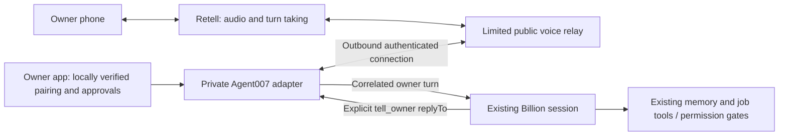

# Calling the existing Billion — research, 2026-10-02

**Feasible, with a custom authenticated bridge. Answering Machina alone does not connect a caller to Billion.** Recommend Retell custom-LLM transport → narrow relay → private Agent007 session adapter. Reuse the kit's call-testing ideas; keep Billion's existing memory, conversation and job tools in Billion. Free-first: the existing app's dictation/read-aloud or Telegram voice notes, where already configured, reach the same agent without PSTN charges. These are not continuous phone conversations.

**Delivered:** isolated in-memory proof, 12 passing tests, no live integration. No installer, provider call, signup, credential grant, message to the live owner inbox, canonical edit, restart, deployment, number purchase or routing change. This research branch has no PR. Any real implementation/security change requires a separately reviewed PR.

## What was inspected

- Agent007 base `def751946d3763a383672e0ce2fff3dbbf562a87`; read AGENTS.md, CLAUDE.md and CONTRIBUTING.md first. This worktree has no `.codegraph/`, so CodeGraph was skipped here. Read-only process inspection found the listener on port 7007 at PID 27836, cwd `/Users/samslung/Projects/agent-007`, whose HEAD matched the base. That canonical checkout has an index; no source discovery was performed there. Disk HEAD does not prove the loaded process version. No environment, credentials or personal memory was dumped.
- Answering Machina [inspected commit](https://github.com/peterchee-os/answering-machina/tree/6e275daf0f878c62bfbbe3d31b8c6fc9a92f10f3), fetched into a temporary no-checkout clone, not executed. Its entire tree contains documentation, prompts, example knowledge bases and setup playbooks, not a running bridge/server. [MIT license](https://github.com/peterchee-os/answering-machina/blob/6e275daf0f878c62bfbbe3d31b8c6fc9a92f10f3/LICENSE): retain copyright/license if copying substantial material. Providers have separate service terms.
- The [README](https://github.com/peterchee-os/answering-machina/blob/6e275daf0f878c62bfbbe3d31b8c6fc9a92f10f3/README.md) describes a v0.1 receptionist: xAI live at one business; Retell ChatGPT browser tested, phone untested; Claude operator untested. Its operator configures another agent. The [Retell test report](https://github.com/peterchee-os/answering-machina/blob/6e275daf0f878c62bfbbe3d31b8c6fc9a92f10f3/operators/chatgpt-dot/TEST-REPORT-2026-10-01.md) shows basic web voice and one email, not live access to the operator's session. No Gmail, Zapier or receptionist knowledge-base upload is needed for our route.

## Existing adapter inventory and missing contract

Paths below refer to the inspected base, not evidence of live configuration.

| Surface | Current behavior | Implication |
| --- | --- | --- |
| `server/ws.js:328,342,545` | `chat-send` → `ownerSays`; browser-origin check; `mayAnswerOwner()` is `!authEnabled()` | Local single-owner gate, **not** reusable authenticated owner identity. Do not spoof Origin or reuse the public WebSocket as an owner API. |
| `server/owner.js:612` | `ownerSays` → `liveBillion()` → `sendText`, persists owner bubble with generated ID and `awaitsReply`; returns only `{ok}` | Correct conceptual ingress, but needs an explicit request ID return, voice provenance and idempotency. Also handles round shortcuts; never allow them before authentication. |
| `server/messages.js:172,203` | Bounded queue; sanitizes terminal escapes; delivery only while WAITING, not held/typing/in a permission dialog | Preserve this queue; do not inject keystrokes into a busy PTY. Busy Billion can make voice replies slow. |
| `server/billion.js:49`, `server/state.js` | Running `isBillion` session lives in process memory | Importing modules in a second process would not connect to that live session. Pin its session/generation; reject changes instead of starting another Billion. |
| `server/owner.js:791`, `server/billion-status.js:34` | `tellOwner` persists `replyTo` for oldest pending owner request; channel is global last-owner-channel | Concurrent app/Telegram/voice can misassociate replies. Add explicit request correlation to `tell_owner`, validated against pending requests; preserve legacy callers. Never speak the next arbitrary chat bubble. |
| `server/owner.js:1113`, `server/voice.js` | Telegram chat-ID filter; local whisper.cpp transcription and macOS `say`/ffmpeg reply; 5 min/20 MB note limits | Existing asynchronous voiceTelegram equivalent. Group chat identity is not individual owner authentication; do not use it as phone approval authority. Setup availability was not probed. |
| `server/http.js:112,167`, `server/mcp.js` | Agent-session authenticated `/mcp`; `tell_owner` and permission answering restricted to Billion | Leave tools and credentials here. Never expose `/mcp`, PTY control, arbitrary tool names or Gmail to the caller/provider. |

## Proposed smallest bridge (not implemented)

Retell's [custom-LLM interface](https://docs.retellai.com/integrate-llm/overview) supplies ASR, TTS, telephony and turn-taking; our server supplies reply text. Its [protocol](https://docs.retellai.com/api-references/llm-websocket) has call IDs, response IDs, partial/final responses, reminders, keepalives and end-call. This route avoids an additional receptionist reasoning model. xAI's [Voice API](https://docs.x.ai/developers/model-capabilities/audio/speech-to-speech) supports VAD and custom functions, so it is an alternative, but it still requires our private bridge and introduces another reasoning layer; the kit's Builder wiring is not that bridge.

1. **Owner authentication:** proposed first version requires a local Mac owner action protected by OS authentication (or separately reviewed passkey enrollment). During a call, relay speaks a random challenge; owner matches and approves it in the local app. Create a one-use, 60-second pairing capability bound to provider call ID, owner, exact Billion session/generation and allowed channel. Limit attempts to 3, one active owner call, 5-minute call lease; revoke on end. Challenges authorize nothing alone. No caller-ID, voiceprint, spoken claim or group Telegram message confers authority. Remote app approval needs a reviewed authenticated transport first; current origin checks are insufficient. No enrollment or credentials were created here.
2. **Provider boundary:** WSS only at a separate relay, with rate/size limits and no agent secrets. Retell [sends no WebSocket auth headers](https://docs.retellai.com/integrate-llm/setup-websocket-server); its documented options are outbound-IP allowlisting and a secret URL path/query. Use both, redact the entire secret-bearing URL from logs, and validate call/agent association via signed lifecycle events or server-side Get Call. [Webhook signatures](https://docs.retellai.com/features/secure-webhook) apply to HTTP raw bodies, not magically to the socket. Pin the intended agent and reject mismatches/replays. Fail closed if provider identity cannot be established. Mac connects outbound using a new narrowly scoped relay capability after review; no public Agent007 listener/tunnel.
3. **Tool/permission boundary:** relay accepts only submit-turn, correlated reply/status and end/cancel-interest. The caller cannot select session IDs or tools. Billion retains existing app permissions and job tools; voice authority never upgrades them. Initial pilot is conversation/read-only. Side effects must produce a concrete pending action in the app; confirmation binds action hash, request ID and expiry, with normal permission checks at execution. A spoken yes cannot auto-answer unrelated terminal dialogs. This requires enforcement, not merely a receptionist prompt.
4. **Correlation/deduplication:** internal stable `{owner, sessionGeneration, callId, turnId, requestId}`; persist acceptance and payload hash before enqueue, atomically with adapter delivery bookkeeping. `tell_owner(replyTo=requestId)` must identify the request. Provider `response_id` is a speech-generation ID, **not an action idempotency key**: retain a committed utterance ID across full-transcript repeats, reminders and new response IDs. Finalize/confirm actionable ASR before dispatch; revisions cannot silently replace dispatched work. Tool effects need their own durable idempotency receipts. After ambiguous failure query status; do not blindly retry. Exactly-once arbitrary external effects cannot be guaranteed by this relay alone.
5. **Conversation:** commit only final new owner utterances; no interim ASR or full repeated transcript into Billion. Stream sentence chunks of explicit owner-facing replies, never terminal output/reasoning. Keep barge-in enabled; suppress stale TTS on interruption and track what was actually spoken. Interrupting audio does not undo jobs. Deterministic “Billion is working” at about 1 second; updates from safe `set_status` only. Target first useful answer ≤5 seconds for simple requests, stop speech ≤500 ms after interruption; these are test targets, not measurements. At 20 seconds offer to continue in app; 60 seconds unresolved, 30 seconds idle after warning, or 5 minutes total ends the call. Busy/approval-waiting agent reports that fact without bypassing gates.
6. **Lifecycle:** signed call end, socket failure, lease expiry or session-generation change stops accepting turns and drops outbound speech. Withdraw only definitely undispatched work; dispatched work remains visible in app and is not described as cancelled. Late results remain in the correlated app thread. Reconnect requires the same live call binding and durable replay ledger; never attaches to a different caller. Initial pilot can fail closed on disconnect rather than reconnect.

## Published costs and data handling

Checked public official pages 2026-10-02; USD, US local inbound calls, no forwarding, tax, hosting or add-ons. Actual existing Billion subscription/API billing was not inspected. Its model/tool usage is additional and task-dependent; there is no honest fixed per-minute Billion price.

| Route | Published components and example |
| --- | --- |
| Recommended Retell custom LLM | Voice infra $0.055/min + platform TTS $0.015/min + displayed telephony $0.015/min = **estimated $0.085/min + $2/month number**, plus Billion. 10 minutes ≈$0.85; 100 minutes/month ≈$10.50 including number. Confirm destination and custom-LLM invoice before paid pilot; no hosted Retell LLM assumed. |
| xAI Builder reference | $0.08/min speech model + $0.01/min telephony, free provisioned number: $0.09/min, $9/100 minutes, before custom Billion bridge/usage. API pricing also lists $0.004/text input; account for that when designing an API relay. |
| More engineering: Twilio + own audio stack | US inbound $0.0085/min + Media Streams $0.0044/min + $1.15/month local number. With local STT/TTS: ≈$2.44/100 minutes plus machine/Billion cost; continuous local audio latency untested. With xAI speech-to-speech: ≈$10.44/100 minutes plus text inputs/Billion. |

Rates: [Retell pricing](https://www.retellai.com/pricing), [xAI pricing](https://docs.x.ai/developers/pricing), [Builder announcement](https://x.ai/news/grok-voice-agent-builder), [Twilio US pricing](https://www.twilio.com/en-us/voice/pricing/us). Retell also lists hosted model fees (e.g. GPT 4.1 mini $0.0128/min); they buy a separate model, not Billion. Retell bills silence too. [Billing exceptions](https://docs.retellai.com/accounts/billing-exceptions) include dynamic greeting minimums and long hosted-model context scaling; validate the selected custom configuration rather than copying the kit's estimate.

[Retell billing](https://docs.retellai.com/accounts/billing): $10 trial credit for eligible new email, prepaid usage after the September 30 migration, recurring numbers billed separately. Manual purchase minimum is **not specified** on the inspected page; must verify in console before purchase. Auto-recharge minimum target is $20 (trigger $10); leave it off. [xAI billing](https://docs.x.ai/console/billing) documents $5 minimum auto-top-up; the kit reports $5 minimum manual purchase, not independently confirmed here. [Twilio upgrade docs](https://help.twilio.com/articles/223183208-Upgrading-to-a-paid-Twilio-Account) require funding and identity details; an older [official Authy migration page](https://help.twilio.com/articles/19753667100059) cites $20 initial funding, so recheck the current checkout rather than promising that minimum. No checkout was entered.

Retell [storage controls](https://docs.retellai.com/accounts/privacy-disable) support Basic Attributes Only; transient recordings can still appear in webhooks with 10-minute links. [Retention](https://docs.retellai.com/accounts/data-retention) defaults to forever, configurable 1–730 days. Recommend Basic Attributes Only, shortest retention, no local audio or webhook artifact downloads, metadata-only relay logs; owner turns/replies still enter normal local app history. Review [Retell terms](https://www.retellai.com/legal/terms-of-service), including recording/training language, before real private content. Do not claim zero processing/recording from a no-storage setting. xAI Builder records calls; [API security policy](https://docs.x.ai/developers/faq/security) describes 30-day retention, no training without permission and team-wide ZDR with feature tradeoffs. Twilio recordings are separately priced and should remain disabled. Approve disclosure/consent handling before any pilot; end if caller declines. No retention settings changed.

## Proof and staged acceptance

Run `node --test research/billion-phone/mock-bridge.test.mjs` (Node built-ins only). **12/12 passed.** One fake call submits through a proposed adapter contract and gets a correlated fake Billion reply. Other cases cover unauthenticated input, binding/expiry/replay, duplicate/conflict, disconnect before/after dispatch, timeout, wrong call/session/request, interruption and ambiguous delivery failure. No real audio, provider connection, cryptographic auth, app permissions, durable ledger or live Billion is exercised. The mock's grant object and memory cache are test doubles, never a production security implementation; timeout checks use a fake clock, not a real hangup timer.

Next stages for Billion to decide; none authorized/executed by this proof:

1. Separate implementation/security PR: implement local owner pairing, scoped outbound adapter, explicit reply correlation, persistent dedup/action receipts and lifecycle timers. Test against a disposable Agent007/Billion fixture, including pending app/Telegram messages, permission prompts, restart/replay, revised transcripts and same-turn/new-response-ID repeats. Review before any runtime change.
2. Free-first voice UX: existing app dictation/read-aloud or already-configured Telegram notes; then approved Retell web-call trial with fake session and eligible existing credit. Browser microphone, owner-controlled provider account and restricted test-agent configuration required. No Gmail, OAuth expansion, model key or paid number needed for the local proof. Hosted trial eligibility is not assumed.
3. Owner-approved phone E2E: restricted Retell key/signing key, test agent, reviewed TLS relay host, local pairing, approved number/payment method and privacy choices. Runtime key limited to required call-read/stop permissions plus verification; configuration/provisioning kept separate. No operator MCP is necessary. Start with one owner, one call, ≤5 min/call, ≤20 min total, **$5 usage stop plus explicitly approved number cost**, no auto-topup; this is a proposal within the later $50/day ceiling, not spending permission.
4. Acceptance: (a) unauthenticated/spoofed caller hears no private content and creates no owner turn; (b) pair and recall a benign fact already known to the **actual same Billion session**, check its session ID and matching app `replyTo`; (c) ask about an existing job and follow up, without duplicating memory into provider KB; (d) request one harmless reversible job only when separately approved, verify exact app confirmation and one job receipt despite replay; (e) test interruption, long tool delay, concurrent app message, disconnect, timeout and late reply; (f) test invalid provider signature/socket binding, replayed pairing and another caller; (g) measure end-of-speech→ack/useful reply, barge-in stop and billed duration, verify storage and invoice. Fail if any wrong reply, duplicate action, permission bypass or secret disclosure. Phone success requires this real test; today's mock is not phone E2E.
5. Pilot rollback: disable test-agent number routing/relay acceptance and revoke only its scoped capability; keep Billion running and preserve app results. Do not change business-line forwarding. Any continued deployment is a later decision.

Assumptions: US inbound English pilot, owner can approve pairing locally initially, paid provider account/credit availability unknown, no infrastructure hosting cost estimate without a chosen host. Repo artifacts are the durable handoff; no Drive copy or sharing changes were made.
